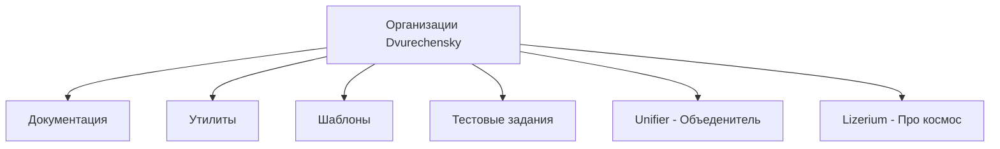
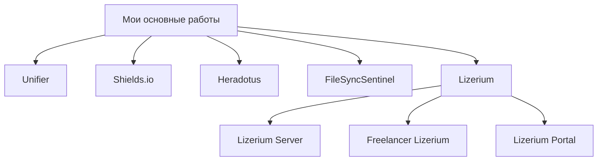
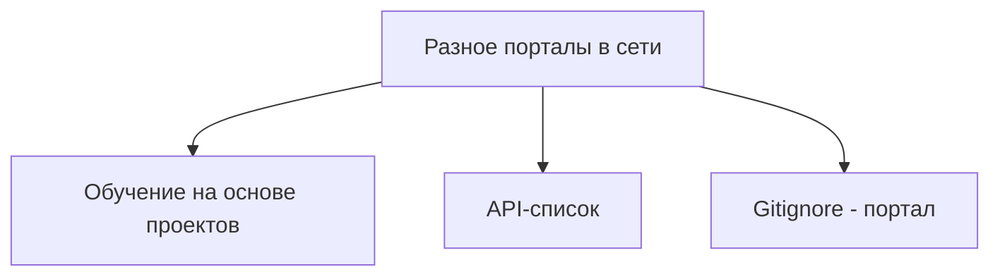
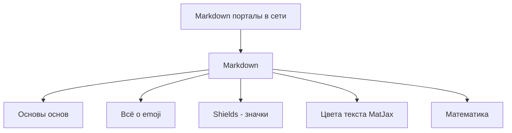
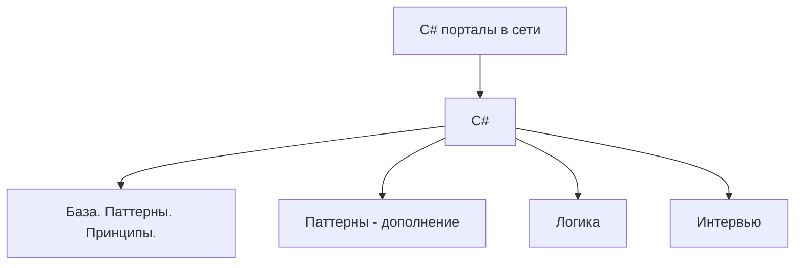
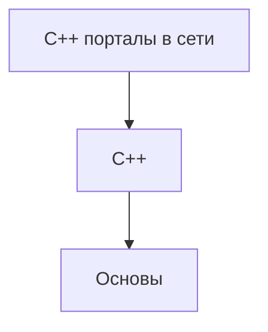
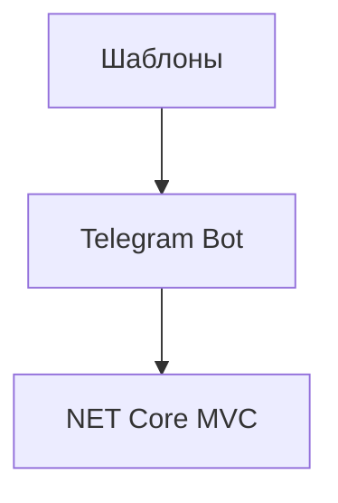

  <strong>🌐 Язык: </strong>
  
  
    ✅ 🇷🇺 Русский (текущий)
  
  | 
  <a href="./README_en.md" style="color: #0891b2; margin: 0 10px;">
    🇺🇸 English
  </a>

  <picture>
    
  </picture>
  <h2>👋 Всем привет, Я Николай Двуреченский  💻 Разработчик полного цикла</h2>

    

> 🎯 `Реверс`-инженер · Full-stack & `Unity` разработчик · Поклонник `.NET`
> 🌌 `Универсальный` программист в мире **`Веб` · `Unity` · `Linux` · `Security`**

- [🚀 Обо мне](#-обо-мне)
- [🌌 Проекты · Утилиты · Организации](#-проекты--утилиты--организации)
  - [Проекты · Утилиты 🐠](#проекты--утилиты-)
    - [Важные работы 🌌](#важные-работы-)
    - [📚 C++ · GitHub](#-c--github)
    - [📚 Шаблоны](#-шаблоны)
- [💼 Опыт работы](#-опыт-работы)
- [🛠️ Технологический стек](#️-технологический-стек)
- [🧠 Текущие направления](#-текущие-направления)

## 🚀 Обо мне

- 💻 Начал программировать с реверс-инжиниринга онлайн-игр
- 🛠️ Создаю инструменты автоматизации, игровые клиенты и бэкенд-системы с 2014 года
- 🌍 Нахожусь в **Москве**
- 🎨 Увлекаюсь **NET, реверс-инжинирингом, Unity HDRP, Linux, безопасностью и экспериментальными проектами, владею практически всеми популярными языками**
- ⚡ Забавный факт: называю себя хакером — но в хорошем смысле, заканчил курс по белому хакингу от `CyberEd`😉

📫 Свяжитесь со мной: [dvurechensky_pro@mail.ru](mailto:dvurechensky_pro@mail.ru)
🌐 Портфолио: [dvurechensky.pro](https://sites.google.com/view/dvurechensky)

## 🌌 Проекты · Утилиты · Организации

<strong>🐌 Организации GitHub (6)</strong>

| 🔗 Проект                                                             | 📖 Описание                                                                                                                               |
| --------------------------------------------------------------------- | ----------------------------------------------------------------------------------------------------------------------------------------- |
| [Dvurechensky Docs](https://github.com/Dvurechensky-Docs)             | Мои разработки или чрезвычайно полезные форки документации, необходимые для повседневной разработки.                                      |
| [Dvurechensky Tools](https://github.com/Dvurechensky-Tools)           | Программы и утилиты, которые я модифицировал или создал с нуля, полезные в различных областях.                                            |
| [Dvurechensky Test Tasks](https://github.com/Dvurechensky-Test-Tasks) | Мой реестр тестовых заданий, выполненных мной бесплатно.                                                                                  |
| [Dvurechensky Templates](https://github.com/Dvurechensky-Templates)   | Мои шаблоны для создания проектов.                                                                                                        |
| [Lizerium](https://github.com/Lizerium)                               | Здесь собраны утилиты для игры Freelancer, созданные или воссозданные мной, проекты - Freelancer Lizerium Unity и модификация Freelancer. |
| [Unifier of Systems](https://github.com/Unifier-of-Systems)           | Унифицирующие сервисы и технологии.                                                                                                       |

### Проекты · Утилиты 🐠

 

<strong>Важные работы 💼 (8)</strong>

#### Важные работы 🌌

<table>
  <thead>
    <tr>
      <th>🔗 Проект</th>
      <th>📖 Описание</th>
      <th>Языки</th>
    </tr>
  </thead>
  <tbody>
    <tr>
      <td data-label="Проект"><a href="https://lizup.ru/">Lizerium Portal</a></td>
      <td data-label="Описание">Разработанный мной портал для <code>космического</code> <code>симулятора</code> — это огромный портал под игру с базой знаний о игре <code>Freelancer (2003)</code>.</td>
      <td data-label="Языки"><code>ASP Net Core 6.0 · MVC · TypeScript · EF Core</code></td>
    </tr>
    <tr>
      <td data-label="Проект"><a href="https://lizup.ru/Home/Game">Freelancer Lizerium</a></td>
      <td data-label="Описание">Разработанный мной <code>космический</code> <code>симулятор</code> — это моя игра в жанре <code>космические симуляторы</code> на базе <code>Freelancer (2003)</code> (Мультиплеер и одиночный режим).</td>
      <td data-label="Языки"><code>C++ · Assembler x86</code></td>
    </tr>
    <tr>
      <td data-label="Проект">
        <a href="https://lizup.ru/Home/Game">Lizerium Server</a> | 
        <a href="https://www.gs4u.net/ru/s/398133.html">GS4u.net — Мониторинг игровых серверов</a>
      </td>
      <td data-label="Описание">Разработанный мной сервер на <code>космический</code> <code>симулятор</code> <a href="https://lizup.ru/Home/Game">Freelancer Lizerium</a> — это огромное дополнение, которое состоит из 50+ плагинов, импортирующих новые функции в игровой процесс.</td>
      <td data-label="Языки"><code>C++ · Asm x86</code></td>
    </tr>
    <tr>
      <td data-label="Проект"><a href="https://lizup.ru/Home/Game">Lizerium Steam</a></td>
      <td data-label="Описание">Разработанный мной <code>загрузчик игр</code> серии Freelancer — это технически всем известный <code>Steam</code> по своему <code>поведению</code>, и он может <code>портировать</code> и <code>обновлять</code> содержимое и <code>сам себя</code>.</td>
      <td data-label="Языки"><code>WPF · Prism MVVM · Handy Control</code></td>
    </tr>
    <tr>
      <td data-label="Проект"><a href="https://github.com/Dvurechensky-Tools/Heradotus">Heradotus</a></td>
      <td data-label="Описание">Ваш <code>конструктор</code> <code>сценариев</code> для презентаций и демонстраций. Для разработчиков, понимающих <code>Markdown</code>.</td>
      <td data-label="Языки"><code>WPF · Prism MVVM · Handy Control</code></td>
    </tr>
    <tr>
      <td data-label="Проект"><a href="https://github.com/Dvurechensky-Tools/FileSyncSentinel">FileSyncSentinel</a></td>
      <td data-label="Описание">Мощный <code>мониторинг</code> изменений файлов в реальном времени с интеллектуальным <code>сравнением</code> 🔍.</td>
      <td data-label="Языки"><code>WinForms · MVC · DiffPlex · .NET 8.0</code></td>
    </tr>
    <tr>
      <td data-label="Проект"><a href="https://shields.dvurechensky.pro/">Русский Shields.io</a></td>
      <td data-label="Описание">Генератор красивых бейджей на русском языке.</td>
      <td data-label="Языки"><code>JS/TS · Canvas / WebGL · Node JS · Redis</code></td>
    </tr>
    <tr>
      <td data-label="Проект"><a href="https://unifier.dvurechensky.pro/">Unifier</a></td>
      <td data-label="Описание">Демонстрация операционных систем, графов их процессов, система управления устройствами.</td>
      <td data-label="Языки"><code>JS/TS · .NET 8.0 · Tree JS · Rabbit MQ · PostgreSQL</code></td>
    </tr>
  </tbody>
</table>

 

<strong>Интернет-порталы от меня 📚 (13)</strong>

<h4 align="center"> 📚 Разное · GitHub </h4>

| 🔗 Проект                                                                                | 📖 Описание                                                          |
| ---------------------------------------------------------------------------------------- | -------------------------------------------------------------------- |
| [Обучение на основе проектов](https://dvurechensky-docs.github.io/ProjectBasedLearning/) | Ccылки на ресурсы по категориям языков программирования для обучения |
| [API-список](https://dvurechensky-docs.github.io/Internet/)                              | Каталог открытых API по категориям                                   |
| [Gitignore - портал](https://dvurechensky-docs.github.io/Gitignore/)                     | Коллекция готовых `.gitignore` + экскурсия по технологиям            |

<h4 align="center"> 📚 Markdown · GitHub </h4>

| 🔗 Проект                                                                                | 📖 Описание                                 |
| ---------------------------------------------------------------------------------------- | ------------------------------------------- |
| [Markdown основы основ](https://dvurechensky-docs.github.io/GeneralDocsMarkdown/)        | Полное руководство по Markdown с лайфхаками |
| [Emoji в Markdown](https://dvurechensky-docs.github.io/EmojiCollectionsMarkdown/)        | Коллекция Emoji                             |
| [Список значков Shields](https://dvurechensky-docs.github.io/ShieldsMarkdown/)           | Коллекция значков Shields                   |
| [Цвета текста через MathJax](https://dvurechensky-docs.github.io/MathJaxColorsMarkdown/) | Примеры цветного текста                     |
| [Математика в Markdown](https://dvurechensky-docs.github.io/MathMarkdown/)               | Пример реализации математических формул     |

<h4 align="center"> 📚 C# · GitHub </h4>

| 🔗 Проект                                                                                                                  | 📖 Описание                                                                                                                                                                    |
| -------------------------------------------------------------------------------------------------------------------------- | ------------------------------------------------------------------------------------------------------------------------------------------------------------------------------ |
| [Разбор языка программирования C#.](https://dvurechensky-docs.github.io/BasicKnowledgeCSharp/)                             | Обзор функционала языка програмиирования C#, решение задач.                                                                                                                    |
| [Шаблоны проектирования. ООП. Тестирование. Коллекции C#.](https://dvurechensky-docs.github.io/PatternsCSharpProgramming/) | Основы объектно-ориентированного программирования, а также шаблоны программирования в C# с примерами их реализации, тестирование, объянение принципов и решение задач LetCode. |
| [Паттерны (дополнение) C#](https://dvurechensky-docs.github.io/PatternsCSharpExtraAddons/)                                 | Образцы, шаблоны, схемы программирования в C# с примерами их реализации                                                                                                        |
| [Вопросы на собеседованиях по C# (NET)](https://dvurechensky-docs.github.io/InterviewCSharpNet/)                           | Обзор вопросов по языку программирования C# и технологии .NET                                                                                                                  |

#### 📚 C++ · GitHub

| 🔗 Проект                                                                                       | 📖 Описание                                                  |
| ----------------------------------------------------------------------------------------------- | ------------------------------------------------------------ |
| [Разбор 🚏 языка программирования C++.](https://dvurechensky-docs.github.io/BasicKnowledgeCPP/) | Обзор функционала языка програмиирования C++, решение задач. |

 

<strong>Шаблоны 📚 (2)</strong>

#### 📚 Шаблоны

| 🔗 Проект                                                                                | 📖 Описание                                                                                 |
| ---------------------------------------------------------------------------------------- | ------------------------------------------------------------------------------------------- |
| [Telegram Bot 🚏 Шаблон.](https://github.com/Dvurechensky-Templates/TelegramBotTemplate) | Чистая, многоуровневая архитектура. Легко масштабируется и добавляет новые команды/сервисы. |
| [Net Core 🚏 Шаблон.](https://github.com/Dvurechensky-Templates/NetCoreTemplate)         | ASP.NET Core MVC, шаблон проекта Frontend — TypeScript                                      |

  <h3>📊 График моих активностей на GitHub</h3>
  

## 💼 Опыт работы

 Раскрыть 

<h4 align="center"><strong>OXSIONSOFT, Lizerium   (Март 2021 – Настоящее время, 4+ года)</strong></h4>

<i>Unity - разработчик</i>

- Работал над проектом <strong>Ceek Virtual Reality</strong>: разработка функционала, исправление ошибок, редизайн пользовательского интерфейса
   
- Реализовал оптимизацию памяти через <strong>Addressables</strong> → стабильная производительность на Android 7+
   
- Выполнил 3+ крупных эволюции пользовательского интерфейса, мультиплеер на <strong>Photon Engine</strong>, улучшения клиент-серверного API
   
- Писал технические спецификации, сотрудничал между командами
   
- <strong>Стек технологий:</strong> Unity3D, HDRP, VFX Graph, Zenject, Addressables, Blender, Substance, Photoshop, Docker, Photon Engine

<h4 align="center"><strong>Московский институт психоанализа (МИП)   (Февраль 2020 – Настоящее время, 5+ лет)</strong></h4>

<i>Технический специалист</i>

- Оказывал техническую поддержку для онлайн видео платформы (MTS-Link)
   
- Помог 1000+ пользователям любого возраста/устройства присоединиться к живым трансляциям
   
- <strong>Стек технологий:</strong> Windows, MacOS

<h4 align="center"><strong>NPC Reagent / SIGMA / CMK Consulting   (2019 – 2025, 5+ лет в общей сложности)</strong></h4>

<i>.NET Разработчик</i>

- Создавал <strong>ASP.NET Core MVC</strong> приложения с PostgreSQL, EF Core, RabbitMQ
   
- Разрабатывал системы визуализации для C# / C++ проектов и зависимостей (NuGet)
   
- Мигрировал проекты с .NET Framework → .NET 6/7/8, применял принципы SOLID, DRY, KISS
   
- Проектировал систему мониторинга пентестов (сбор данных, визуализация, аналитика)
   
- Развертывал микросервисы в <strong>Docker</strong>, автоматизировал сборки с Jenkins
   
- <strong>Стек технологий:</strong> C#, ASP.NET Core (6–8), PostgreSQL, RabbitMQ, EF Core, Cytoscape.js, Three.js, Docker, Jenkins, Git, SVN

<h4 align="center"><strong>Freelancer Rebirth   (Ноябрь 2020 – Ноябрь 2023, 3 года)</strong></h4>

<i>C++ Разработчик</i>

- Поддерживал крупнейший мод для СНГ для <strong>Freelancer (2003)</strong>
   
- Мигрировал 25+ плагинов и ядро в унифицированное C++ решение
   
- Выполнил 3 крупные миграции проекта между поколениями Visual Studio
   
- <strong>Стек технологий:</strong> C++, Boost, Assembler, Git

<h4 align="center"><strong>ИнтерЭВМ & ЦИТиС   (Февраль 2020 – Июнь 2023, 3+ года)</strong></h4>

<i>Системный инженер</i>

- Разрабатывал системы мониторинга (Qt) и анализаторы данных (Python, PHP)
   
- Создавал XSLT шаблоны, оптимизировал PostgreSQL запросы
   
- Работал с окружениями Astra Linux, Ubuntu, Debian, Windows
   
- <strong>Стек технологий:</strong> Linux (Astra, Ubuntu, Debian), Qt, PHP, Python, SQL, XSLT/XML

<h4 align="center"><strong>Другие роли   (2017 – 2020)</strong></h4>

- <strong>ООО Промэлектроника (Липецк)</strong> — Инженер по автоматизации: контроллеры Siemens, SCADA, встраиваемые системы
   
- <strong>ЮрЭксперт (Воронеж)</strong> — Системный администратор: автоматизация рабочих мест, автоматизация документооборота

## 🛠️ Технологический стек

 Раскрыть 

<h4><strong>Технологии ядра:</strong></h4>
C#, .NET 3–8, ASP.NET Core (MVC, SignalR), EF Core, RabbitMQ, Redis, Prism (MVVM WPF), Elixir

<h4><strong>Визуализация:</strong></h4>
TypeScript, Cytoscape.js, Three.js, Webpack, Grunt, HandyContol(WPF)

<h4><strong>Тестирование:</strong></h4>
xUnit, nUnit, Integrated

<h4><strong>Игровая разработка:</strong></h4>
Unity (HDRP/URP, Zenject, Addressables, Photon, Object Pooling), ECS (Leo / Unity / Custom), Blender, Substance Painter, Photoshop

<h4><strong>Базы данных:</strong></h4>
PostgreSQL, SQL Server, Redis, MySQL, EF Core

<h4><strong>Инженерные навыки:</strong></h4>
Linux (Astra, Ubuntu, Debian, Kali, Parrot OS), Docker, Jenkins, nginx, Git, SVN, Gitea

<h4><strong>Языки и инструменты:</strong></h4>
C++, Boost, Qt, Python, Bash, Shell, IDA Pro, OllyDbg, Burp Suite Pro

## 🧠 Текущие направления

- Кроссплатформенные инструменты для .NET 8 / Linux
- Боты для всех популярных соц. сетей
- Расширение порталов с открытым исходным кодом и документацией
- Автоматизация всех процессов и выход на свою систему управления проектов

`Псевдонимы в сети:` **Dvurechensky** · **dvurechensky_pro** · **Dvurechensky Media** · **Dormammu Media** · **Rota**

    

        

        
    
 
    
 

<!-- Donationes -->

<table align="center" style="border-collapse: collapse; min-width: 300px; width: 100%;">
<tr>
    <td colspan="3" align="center">
    <b>💚 Спасибо за вашу поддержку! Вы можете сделать пожертвование, используя информацию ниже. 🙏</b>
    </td>
</tr>
<tr>
    <th style="padding: 8px; text-align: center;">Платежи</th>
    <th style="padding: 8px; text-align: center;">Адрес</th>
    <th style="padding: 8px; text-align: center;">QR-код</th>
</tr>
<tr>
    <td style="padding: 8px; text-align: center;">
    
    </td>
    <td style="padding: 8px; text-align: center;"><code>bc1qlrqjhdeqtzd0dnvw7lj0gc0r8kke8m8rc7dxym</code></td>
    <td style="padding: 8px; text-align: center;"></td>
</tr>
<tr>
    <td style="padding: 8px; text-align: center;">
    
    </td>
    <td style="padding: 8px; text-align: center;"><code>dvurechensky_pro</code></td>
    <td style="padding: 8px; text-align: center;"></td>
</tr>
</table>

> 2025
