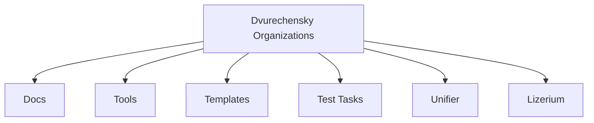
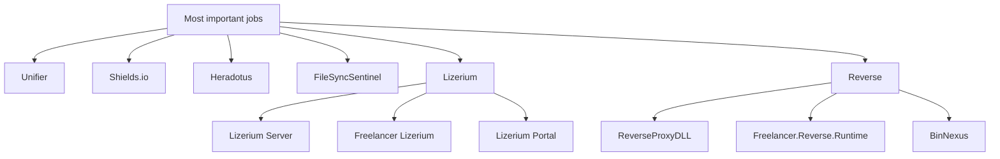
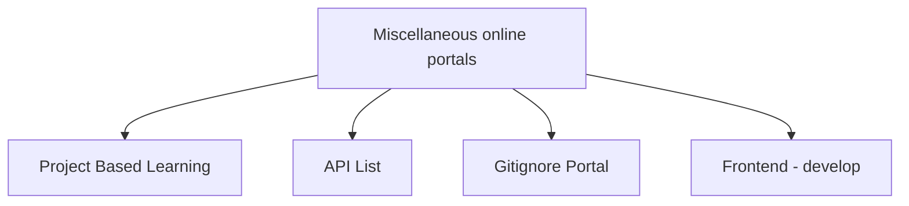
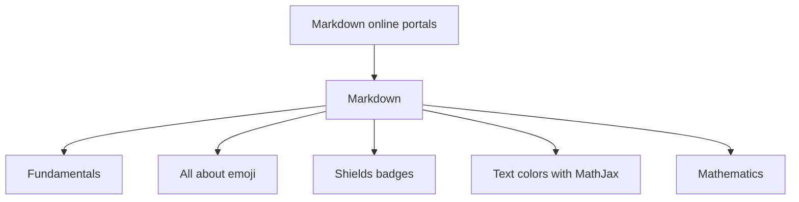
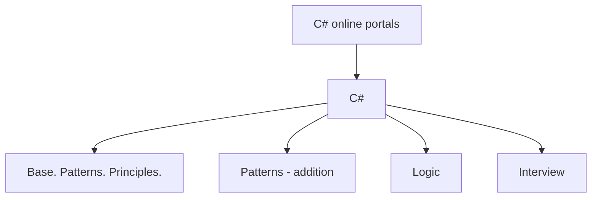
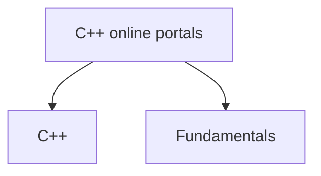
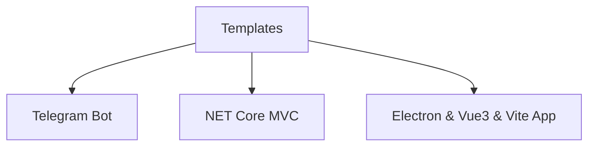

  <strong>🌐 Language: </strong>
  
  <a href="./README.ru.md" style="color: #F5F752; margin: 0 10px;">
    🇷🇺 Russian
  </a>
  | 
  
    ✅ 🇺🇸 English (current)
  

  <picture>
    
  </picture>
  <h2>
  Hi, I'm Nikolai Dvurechensky 
  Systems Engineer • Reverse Developer • Full Stack Engineer
  </h2>
  <h4>Available for <b>strong</b> teams & <u><b>interesting products</b></u></h4>
  <b>.NET</b> • C/<b>C++</b> • C# • <b><u>Python</b></u> • Unity • TypeScript • <b><u>Reverse</b></u>  •  Linux • Windows

  

 <h2>
  System Profile
  </h2>

- ••• booting profile...▸
  - [ ◇ ] `Identity`................▸ Nikolai Dvurechensky
  - [ ◇ ] `Started`................▸ Reverse engineering online games
  - [ ◇ ] `Experience`......▸ Since 2014
  - [ ◇ ] `Focus`..................▸ Systems / Reverse / Full Stack
  - [ ◇ ] `Platforms`........▸ Linux / Windows / Web / Unity
  - [ ◇ ] `Status`................▸ Available for strong teams
  - [ ✓ ] `Contact`..............▸ [dvurechenskysoft@gmail.com](mailto:dvurechenskysoft@gmail.com) | [nikolay@dvurechensky.pro](mailto:dvurechenskysoft@gmail.com)
  - [ ✓ ] `Website`...............▸ [dvurechensky.pro](https://dvurechensky.pro)
  - [ ✓ ] `ORCID`......................▸ [orcid.org](https://orcid.org/0009-0004-2701-5592)

  

<a href="#organizations">Organizations</a> ·
<a href="#experience">Experience</a> ·
<a href="#tech-stack">Stack</a>

◇

<a href="#utilities">Utilities</a> ·
<a href="#focus">Focus</a>

  

## Organizations

<a href="#top">↑ Back to Top</a>

<strong>◇ Organizations · GitHub <b>(6)</b></strong>

```mermaid
graph TD
  A[Dvurechensky Organizations] --> B[Docs]
  A --> E[Tools]
  A --> M[Templates]
  A --> G[Test Tasks]
  A --> H[Unifier]
  A --> K[Lizerium]
```

| ⌁ Project                                                             | ⌁ Description                                                                                                                                                    |
| --------------------------------------------------------------------- | ---------------------------------------------------------------------------------------------------------------------------------------------------------------- |
| [Dvurechensky Docs](https://github.com/Dvurechensky-Docs)             | My developments or extremely useful forks of documentation necessary for daily development.                                                                      |
| [Dvurechensky Tools](https://github.com/Dvurechensky-Tools)           | Programs and utilities that I modified or created from scratch, useful in different areas.                                                                       |
| [Dvurechensky Test Tasks](https://github.com/Dvurechensky-Test-Tasks) | My register of test tasks completed by me free of charge.                                                                                                        |
| [Dvurechensky Templates](https://github.com/Dvurechensky-Templates)   | My templates for creating projects.                                                                                                                              |
| [Lizerium](https://github.com/Lizerium)                               | Here are collected utilities for the game Freelancer, created or recreated by Dvurechensky, projects - Freelancer Lizerium Unity and modification of Freelancer. |
| [Unifier of Systems](https://github.com/Unifier-of-Systems)           | Unifying services and technology.                                                                                                                                |

  

## Experience

<a href="#top">↑ Back to Top</a>

 ◇ View Experience 

<h4 align="center"><strong>OXSIONSOFT, Lizerium   (Mar 2021 – 2026, 5+ years)</strong></h4>

<i>Unity Developer</i>

- Worked on <strong>Ceek Virtual Reality</strong> project: feature development, bug fixing, UI redesigns
   
- Implemented memory optimization via <strong>Addressables</strong> → stable performance on Android 7+
   
- Delivered 3+ major UI evolutions, multiplayer on <strong>Photon Engine</strong>, client-server API improvements
   
- Wrote technical specifications, collaborated across teams
   
- <strong>Stack:</strong> Unity3D, HDRP, VFX Graph, Zenject, Addressables, Blender, Substance, Photoshop, Docker, Photon Engine

  

<h4 align="center"><strong>Moscow Institute of Psychoanalysis (MIP)   (Feb 2020 – Present, 6+ years)</strong></h4>

<i>Technical Specialist</i>

- Provided technical support for online video platform (MTS-Link)
   
- Helped 1000+ users of any age/device join live broadcasts
   
- <strong>Stack:</strong> Windows, MacOS

  

<h4 align="center"><strong>NPC Reagent / SIGMA / CMK Consulting   (2019 – 2025, 5+ years total)</strong></h4>

<i>.NET Developer</i>

- Built <strong>ASP.NET Core MVC</strong> apps with PostgreSQL, EF Core, RabbitMQ
   
- Developed visualization systems for C# / C++ projects and dependencies (NuGet)
   
- Migrated projects across .NET Framework → .NET 6/7/8, applied SOLID, DRY, KISS principles
   
- Designed pentest monitoring system (data collection, visualization, analytics)
   
- Deployed microservices in <strong>Docker</strong>, automated builds with Jenkins
   
- <strong>Stack:</strong> C#, ASP.NET Core (6–8), PostgreSQL, RabbitMQ, EF Core, Cytoscape.js, Three.js, Docker, Jenkins, Git, SVN

  

<h4 align="center"><strong>Freelancer Rebirth   (Nov 2020 – Nov 2023, 3 years)</strong></h4>

<i>C++ Developer</i>

- Maintained the largest CIS mod for <strong>Freelancer (2003)</strong>
   
- Migrated 25+ plugins & core into unified C++ solution
   
- Performed 3 major project migrations across Visual Studio generations
   
- <strong>Stack:</strong> C++, Boost, Assembler, Git

  

<h4 align="center"><strong>InterEVM   (Feb 2020 – Jun 2023, 3+ years)</strong></h4>

<i>System Engineer</i>

- Developed monitoring systems (Qt) and data analyzers (Python, PHP)
   
- Built XSLT templates, optimized PostgreSQL queries
   
- Worked with Astra Linux, Ubuntu, Debian, Windows environments
   
- <strong>Stack:</strong> Linux (Astra, Ubuntu, Debian), Qt, Python, SQL, XSLT/XML

  

<h4 align="center"><strong>Other Roles   (2017 – 2020)</strong></h4>

- <strong>Promelektronika</strong> — Automation engineer: Siemens controllers, SCADA, embedded systems
   
- <strong>YurExpert</strong> — SysAdmin: workplace automation, document automation

  

## Tech Stack

<a href="#top">↑ Back to Top</a>

◇ Open Tech Stack

<h4><strong>◆ Core Engineering</strong></h4>

C#, .NET 3–8, ASP.NET Core (MVC, SignalR), EF Core, Systems Design, Full Stack Development, Reverse Engineering

  

<h4><strong>◆ Backend & Infrastructure</strong></h4>

RabbitMQ, Redis, PostgreSQL, SQL Server, MySQL, Docker, Jenkins, nginx, Linux (Astra / Ubuntu / Debian / Kali / Parrot OS), Git, SVN, Gitea

  

<h4><strong>◆ Frontend & Desktop UI</strong></h4>

TypeScript, Cytoscape.js, Three.js, Webpack, Grunt, Prism (MVVM WPF), HandyControl (WPF), HTML5, SCSS/CSS, Markdown

  

<h4><strong>◆ Game Development</strong></h4>

Unity (HDRP / URP), Zenject, Addressables, Photon, Object Pooling, ECS (Leo / Unity / Custom), Blender, Substance Painter, Photoshop

  

<h4><strong>◆ Languages & Low-Level</strong></h4>

Python, Go, PHP, C, C++, C#, ASM x86, Shell, Bash, Qt, Boost, Elixir, Fortran77

  

<h4><strong>◆ Testing & Diagnostics</strong></h4>

xUnit, nUnit, Integration Testing, IDA Pro, OllyDbg, Burp Suite Pro

  

### Utilities

<a href="#top">↑ Back to Top</a>

 

<strong>◇ Most important · jobs <b>(11)</b></strong>

#### ◇ Most important · jobs

<a href="#top">↑ Back to Top</a>

```mermaid
graph TD
  B[Most important jobs]
  B --> B1[Unifier]
  B --> B2[Shields.io]
  B --> B3[Heradotus]
  B --> B4[FileSyncSentinel]
  B --> E[Lizerium]
  E --> E1[Lizerium Server]
  E --> E2[Freelancer Lizerium]
  E --> E3[Lizerium Portal]
  B --> G[Reverse]
  G --> G1[ReverseProxyDLL]
  G --> G2[Freelancer.Reverse.Runtime]
  G --> G3[BinNexus]
```

<table>
  <thead>
    <tr>
      <th>⌁ Project</th>
      <th>⌁ Description</th>
      <th>Lang</th>
    </tr>
  </thead>
  <tbody>
    <tr>
      <td data-label="Project"><a href="https://github.com/Dvurechensky/BinNexus">BinNexus</a></td>
      <td data-label="Description">BinNexus is a tool for analyzing Windows binaries (DLL/EXE) that builds an interactive web portal with a dependency graph and export exploration.</td>
      <td data-label="Languages"><code>Python · JavaScript · CSS · HTML · C++</code></td>
    </tr>
    <tr>
      <td data-label="Project"><a href="https://github.com/Dvurechensky/ReverseProxyDLL">ReverseProxyDLL</a></td>
      <td data-label="Description">Reverse-aware proxy DLL framework generator for legacy x86 Windows binaries based on export dumps and decompiler output.</td>
      <td data-label="Languages"><code>Python · C++</code></td>
    </tr>
    <tr>
      <td data-label="Project"><a href="https://github.com/Dvurechensky/Freelancer.Reverse.Runtime">Freelancer.Reverse.Runtime</a></td>
      <td data-label="Description">I'm building a runtime layer on top of Freelancer (2003), restoring and overriding system DLLs to safely explore, extend, and document the behavior of the original engine.</td>
      <td data-label="Languages"><code>C · C++ · Batchfile · Asm x86 · Ghidra · x32dbg</code></td>
    </tr>
    <tr>
      <td data-label="Project"><a href="https://lizup.ru/">Lizerium Portal</a></td>
      <td data-label="Description">My developed portal for a <code>space</code> <code>simulator</code> — this is a huge portal for the game with a knowledge base about the game <code>Freelancer (2003)</code>.</td>
      <td data-label="Lang"><code>ASP Net Core 6.0 · MVC · TypeScript · EF Core</code></td>
    </tr>
    <tr>
      <td data-label="Project"><a href="https://lizup.ru/Home/Game">Freelancer Lizerium</a></td>
      <td data-label="Description">My developed <code>space</code> <code>simulator</code> — this is my game in the <code>space simulators</code> genre based on <code>Freelancer (2003)</code> (Multiplayer and single player modes).</td>
      <td data-label="Lang"><code>C++ · Assembler x86</code></td>
    </tr>
    <tr>
      <td data-label="Project">
        <a href="https://lizup.ru/Home/Game">Lizerium Server</a> | 
        <a href="https://www.gs4u.net/ru/s/398133.html">GS4u.net - Game Server Monitoring</a>
      </td>
      <td data-label="Description">My developed server for the <code>space</code> <code>simulator</code> <a href="https://lizup.ru/Home/Game">Freelancer Lizerium</a> — this is a huge expansion that consists of 50+ plugins importing new functions into the gameplay.</td>
      <td data-label="Lang"><code>C++ · Asm x86</code></td>
    </tr>
    <tr>
      <td data-label="Project"><a href="https://lizup.ru/Home/Game">Lizerium Steam</a></td>
      <td data-label="Description">My developed <code>game loader</code> for the Freelancer series — this is technically the well-known <code>Steam</code> in its <code>behavior</code> and it can <code>port</code> and <code>update</code> what's inside it and <code>itself</code>.</td>
      <td data-label="Lang"><code>WPF · Prism MVVM · Handy Control</code></td>
    </tr>
    <tr>
      <td data-label="Project"><a href="https://github.com/Dvurechensky-Tools/Heradotus">Heradotus</a></td>
      <td data-label="Description">Your <code>scenario</code> <code>constructor</code> for presentations and demonstrations. For developers who understand <code>Markdown</code>.</td>
      <td data-label="Lang"><code>WPF · Prism MVVM · Handy Control</code></td>
    </tr>
    <tr>
      <td data-label="Project"><a href="https://github.com/Dvurechensky-Tools/FileSyncSentinel">FileSyncSentinel</a></td>
      <td data-label="Description">Powerful real-time file change <code>monitoring</code> with intelligent <code>comparison</code> 🔍.</td>
      <td data-label="Lang"><code>WinForms · MVC · DiffPlex · NET 8.0</code></td>
    </tr>
    <tr>
      <td data-label="Project"><a href="https://shields.dvurechensky.pro/">Russian Shields.io</a></td>
      <td data-label="Description">Beautiful badge generator in Russian language.</td>
      <td data-label="Lang"><code>JS/TS · Canvas / WebGL · Node JS · Redis</code></td>
    </tr>
    <tr>
      <td data-label="Project"><a href="https://unifier.dvurechensky.pro/">Unifier</a></td>
      <td data-label="Description">Registered software system for distributed device interaction and infrastructure orchestration.<a href="https://github.com/Dvurechensky/Dvurechensky/blob/main/Media/files/Unifier.Patent.pdf" target="_blank">📄 Patent</a></td>
      <td data-label="Lang"><code>JS/TS · NET 8.0 · Tree JS · Rabbit MQ · PostgreSQL</code></td>
    </tr>
  </tbody>
</table>

 

<strong>◇ Internet portals · from me <b>(14)</b></strong>

#### ◇ Miscellaneous · GitHub

<a href="#top">↑ Back to Top</a>

```mermaid
graph TD
  C[Miscellaneous online portals]
  C --> R[Project Based Learning]
  C --> M[API List]
  C --> G[Gitignore Portal]
  C --> L[Frontend - develop]
```

| ⌁ Project                                                                           | ⌁ Description                                                                                                                                 |
| ----------------------------------------------------------------------------------- | --------------------------------------------------------------------------------------------------------------------------------------------- |
| [Project Based Learning](https://dvurechensky-docs.github.io/ProjectBasedLearning/) | Links to resources by programming language categories for learning                                                                            |
| [API List](https://dvurechensky-docs.github.io/Internet/)                           | Catalog of open APIs by categories                                                                                                            |
| [Gitignore Portal](https://dvurechensky-docs.github.io/Gitignore/)                  | Collection of ready `.gitignore` files + technology overview                                                                                  |
| [Frontend - develop](https://dvurechensky-docs.github.io/WebFrontendKnowledge/)     | A continuously expanded list of frameworks, libraries and tools I used/want to use for building things on the web. Mostly `Javascript` stuff. |

  

#### ◇ Markdown · GitHub

<a href="#top">↑ Back to Top</a>

```mermaid
graph TD
  C[Markdown online portals]
  C --> H[Markdown]
  H --> K[Fundamentals]
  H --> L[All about emoji]
  H --> Z[Shields badges]
  H --> X[Text colors with MathJax]
  H --> V[Mathematics]
```

| ⌁ Project                                                                             | ⌁ Description                                   |
| ------------------------------------------------------------------------------------- | ----------------------------------------------- |
| [Markdown Docs](https://dvurechensky-docs.github.io/GeneralDocsMarkdown/)             | Complete Markdown guide with lifehacks          |
| [Emoji in Markdown](https://dvurechensky-docs.github.io/EmojiCollectionsMarkdown/)    | Emoji collection                                |
| [Shields Badges List](https://dvurechensky-docs.github.io/ShieldsMarkdown/)           | Collection of Shields badges                    |
| [Text Colors via MathJax](https://dvurechensky-docs.github.io/MathJaxColorsMarkdown/) | Examples of colored text                        |
| [Mathematics in Markdown](https://dvurechensky-docs.github.io/MathMarkdown/)          | Example implementation of mathematical formulas |

  

#### ◇ C# · GitHub

<a href="#top">↑ Back to Top</a>

```mermaid
graph TD
  C[C# online portals]
  C --> N[C#]
  N --> N1[Base. Patterns. Principles.]
  N --> N2[Patterns - addition]
  N --> N3[Logic]
  N --> N4[Interview]
```

| ⌁ Project                                                                                                        | ⌁ Description                                                                                                                                                                               |
| ---------------------------------------------------------------------------------------------------------------- | ------------------------------------------------------------------------------------------------------------------------------------------------------------------------------------------- |
| [Analysis of the C# programming language.](https://dvurechensky-docs.github.io/BasicKnowledgeCSharp/)            | Overview of the C# programming language functionality, problem solving.                                                                                                                     |
| [Design Patterns. OOP. Testing. C# Collections.](https://dvurechensky-docs.github.io/PatternsCSharpProgramming/) | Fundamentals of object-oriented programming, as well as programming patterns in C# with examples of their implementation, testing, explanation of principles and solving LeetCode problems. |
| [Patterns (addition) C#](https://dvurechensky-docs.github.io/PatternsCSharpExtraAddons/)                         | Samples, templates, programming schemes in C# with examples of their implementation                                                                                                         |
| [Interview Questions on C# (NET)](https://dvurechensky-docs.github.io/InterviewCSharpNet/)                       | Overview of questions on the C# programming language and .NET technology                                                                                                                    |

  

#### ◇ C++ · GitHub

<a href="#top">↑ Back to Top</a>

```mermaid
graph TD
  C[C++ online portals]
  C --> W[C++]
  C --> W1[Fundamentals]
```

| ⌁ Project                                                                                              | ⌁ Description                                                            |
| ------------------------------------------------------------------------------------------------------ | ------------------------------------------------------------------------ |
| [Analysis 🚏 of the C++ programming language.](https://dvurechensky-docs.github.io/BasicKnowledgeCPP/) | Overview of the C++ programming language functionality, problem solving. |

 

<strong>◇ Templates <b>(3)</b></strong>

#### ◇ Templates

<a href="#top">↑ Back to Top</a>

```mermaid
graph TD
  C[Templates]
  C --> W[Telegram Bot]
  C --> W1[NET Core MVC]
  C --> W2[Electron & Vue3 & Vite App]
```

| ⌁ Project                                                                                                 | ⌁ Description                                                                                                                            |
| --------------------------------------------------------------------------------------------------------- | ---------------------------------------------------------------------------------------------------------------------------------------- |
| [Telegram Bot 🚏 Template.](https://github.com/Dvurechensky-Templates/TelegramBotTemplate)                | Clean, multi-layered architecture. Easy to scale and add new teams / services.                                                           |
| [Net Core 🚏 Template.](https://github.com/Dvurechensky-Templates/NetCoreTemplate)                        | ASP.NET Core MVC, Frontend Project Template - TypeScript                                                                                 |
| [Electron & Vue3 & Vite 🚏 Template.](https://github.com/Dvurechensky-Templates/ElectronViteTemplateRuEn) | A Vue3 + Vite + Electron project template based on Vite and Rollup. An alternative platformer for producing cross-platform applications. |

  

## Focus

<a href="#top">↑ Back to Top</a>

- [ ◇ ] Runtime systems & reverse research
- [ ◇ ] .NET tools for Windows / Linux
- [ ◇ ] GitHub ecosystem growth
- [ ◇ ] Product engineering opportunities

  

  
  

    

      
      &nbsp;
      
      &nbsp;
      
      &nbsp;
      
      &nbsp;
      
      &nbsp;
      
      &nbsp;
      
    

  

`Nicknames:` **Dvurechensky** · **dvurechensky_pro** · **Dvurechensky Media** · **Dormammu Media** · **Rota**

  

<!-- Donationes -->

<table align="center" style="border-collapse: collapse; min-width: 300px; width: 100%;">
<tr>
    <td colspan="3" align="center">
    <b>💚 Thank you for your support! You can donate using the info below 🙏</b>
    </td>
</tr>
<tr>
    <th style="padding: 8px; text-align: center;">Payments</th>
    <th style="padding: 8px; text-align: center;">Address</th>
    <th style="padding: 8px; text-align: center;">QR Code</th>
</tr>
<tr>
    <td style="padding: 8px; text-align: center;">
    
    </td>
    <td style="padding: 8px; text-align: center;"><code>bc1qlrqjhdeqtzd0dnvw7lj0gc0r8kke8m8rc7dxym</code></td>
    <td style="padding: 8px; text-align: center;"></td>
</tr>
<tr>
    <td style="padding: 8px; text-align: center;">
    
    </td>
    <td style="padding: 8px; text-align: center;"><code>dvurechensky_pro</code></td>
    <td style="padding: 8px; text-align: center;"></td>
</tr>
</table>

  

> 2026
