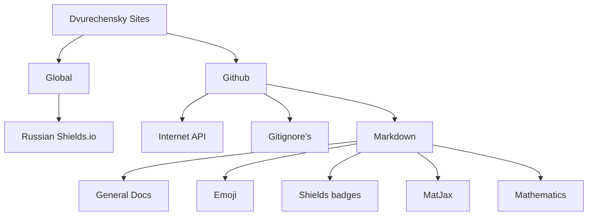

  <picture>
    
  </picture>
  <h2>👋 Hi there, I'm Nikolai Dvurechensky  💻 A passionate Full Stack Developer</h2>

    

> 🎯 `Reverse` Engineer · Full-stack & `Unity` Developer · `.NET` Enthusiast
> 🌌 `Universal` programmer exploring **`Web` · `Unity` · `Linux` · `Security`**
> P.s [Web-version this page](https://dvurechensky.github.io/Dvurechensky/)

- [🚀 About Me](#-about-me)
- [🌌 Projects \& Utilities \& Organizations](#-projects--utilities--organizations)
  - [Organizations 🐌](#organizations-)
  - [Projects \& Utilities 🐠](#projects--utilities-)
    - [📚 Markdown \& GitHub Goodies](#-markdown--github-goodies)
- [💼 Experience](#-experience)
- [🛠️ Tech Stack](#️-tech-stack)
- [🧠 Current Focus](#-current-focus)

## 🚀 About Me

- 💻 Started programming by reverse-engineering online games
- 🛠️ Building automation tools, game clients & backend systems since 2014
- 🌍 Currently based in **Moscow**
- 🎨 Passionate about **Unity HDRP, Linux, security, and experimental projects**
- ⚡ Fun fact: I call myself a hacker — but in the good sense 😉

📫 Reach me: [dvurechensky_pro@mail.ru](mailto:dvurechensky_pro@mail.ru)
🌐 Portfolio: [dvurechensky.pro](https://sites.google.com/view/dvurechensky)

## 🌌 Projects & Utilities & Organizations

### Organizations 🐌

| 🔗 Project                                                            | 📖 Description                                                                                                                                                   |
| --------------------------------------------------------------------- | ---------------------------------------------------------------------------------------------------------------------------------------------------------------- |
| [Dvurechensky Docs](https://github.com/Dvurechensky-Docs)             | My developments or extremely useful forks of documentation necessary for daily development.                                                                      |
| [Dvurechensky Tools](https://github.com/Dvurechensky-Tools)           | Programs and utilities that I modified or created from scratch, useful in different areas.                                                                       |
| [Dvurechensky Test Tasks](https://github.com/Dvurechensky-Test-Tasks) | My register of test tasks completed by me free of charge.                                                                                                        |
| [Dvurechensky Templates](https://github.com/Dvurechensky-Templates)   | My templates for creating projects.                                                                                                                              |
| [Lizerium](https://github.com/Lizerium)                               | Here are collected utilities for the game Freelancer, created or recreated by Dvurechensky, projects - Freelancer Lizerium Unity and modification of Freelancer. |
| [Unifier of Systems](https://github.com/Unifier-of-Systems)           | Unifying services and technology.                                                                                                                                |

### Projects & Utilities 🐠

| 🔗 Project                                                                | 📖 Description                                            |
| ------------------------------------------------------------------------- | --------------------------------------------------------- |
| [Русский Shields.io](https://shields.dvurechensky.pro/)                   | Генератор красивых бейджей на русском языке               |
| [API-список](https://dvurechensky-docs.github.io/Internet/)               | Каталог открытых API по категориям                        |
| [Gitignore Portal](https://dvurechensky-docs.github.io/Gitignore/)        | Коллекция готовых `.gitignore` + экскурсия по технологиям |
| [Markdown Docs](https://dvurechensky-docs.github.io/GeneralDocsMarkdown/) | Полное руководство по Markdown с лайфхаками               |

#### 📚 Markdown & GitHub Goodies

- [Emoji в Markdown](https://dvurechensky-docs.github.io/EmojiCollectionsMarkdown/) 🌁
- [Список значков Shields](https://dvurechensky-docs.github.io/ShieldsMarkdown/) ⛄
- [Цвета текста через MathJax](https://dvurechensky-docs.github.io/MathJaxColorsMarkdown/) ☀️
- [Математика в Markdown](https://dvurechensky-docs.github.io/MathMarkdown/) 🌀

  

## 💼 Experience

 Open 

<h4 align="center"><strong>OXSIONSOFT, Lizerium (Mar 2021 – Present, 4+ years)</strong></h4>

<i>Unity Developer</i>

- Worked on <strong>Ceek Virtual Reality</strong> project: feature development, bug fixing, UI redesigns
- Implemented memory optimization via <strong>Addressables</strong> → stable performance on Android 7+
- Delivered 3+ major UI evolutions, multiplayer on <strong>Photon Engine</strong>, client-server API improvements
- Wrote technical specifications, collaborated across teams
- <strong>Stack:</strong> Unity3D, HDRP, VFX Graph, Zenject, Addressables, Blender, Substance, Photoshop, Docker, Photon Engine

<h4 align="center"><strong>Московский институт психоанализа (MIP) (Feb 2020 – Present, 5+ years)</strong></h4>

<i>Technical Specialist</i>

- Provided technical support for online video platform (MTS-Link)
- Helped 1000+ users of any age/device join live broadcasts
- <strong>Stack:</strong> Windows, MacOS

<h4 align="center"><strong>NPC Reagent / SIGMA / CMK Consulting (2019 – 2025, 5+ years total)</strong></h4>

<i>.NET Developer</i>

- Built <strong>ASP.NET Core MVC</strong> apps with PostgreSQL, EF Core, RabbitMQ
- Developed visualization systems for C# / C++ projects and dependencies (NuGet)
- Migrated projects across .NET Framework → .NET 6/7/8, applied SOLID, DRY, KISS principles
- Designed pentest monitoring system (data collection, visualization, analytics)
- Deployed microservices in <strong>Docker</strong>, automated builds with Jenkins
- <strong>Stack:</strong> C#, ASP.NET Core (6–8), PostgreSQL, RabbitMQ, EF Core, Cytoscape.js, Three.js, Docker, Jenkins, Git, SVN

<h4 align="center"><strong>Freelancer Rebirth (Nov 2020 – Nov 2023, 3 years)</strong></h4>

<i>C++ Developer</i>

- Maintained the largest CIS mod for <strong>Freelancer (2003)</strong>
- Migrated 25+ plugins & core into unified C++ solution
- Performed 3 major project migrations across Visual Studio generations
- <strong>Stack:</strong> C++, Boost, Assembler, Git

<h4 align="center"><strong>InterEVM (Feb 2020 – Jun 2023, 3+ years)</strong></h4>

<i>System Engineer</i>

- Developed monitoring systems (Qt) and data analyzers (Python, PHP)
- Built XSLT templates, optimized PostgreSQL queries
- Worked with Astra Linux, Ubuntu, Debian, Windows environments
- <strong>Stack:</strong> Linux (Astra, Ubuntu, Debian), Qt, Python, SQL, XSLT/XML

<h4 align="center"><strong>Other Roles (2017 – 2020)</strong></h4>

- <strong>Promelektronika</strong> — Automation engineer: Siemens controllers, SCADA, embedded systems
- <strong>YurExpert</strong> — SysAdmin: workplace automation, document automation

## 🛠️ Tech Stack

 Open 

<h4><strong>Backend:</strong></h4>
C#, .NET 6–8, ASP.NET Core (MVC, SignalR), EF Core, RabbitMQ, Redis

<h4><strong>Frontend:</strong></h4>
TypeScript, Cytoscape.js, Three.js, Webpack, Grunt

<h4><strong>Tested:</strong></h4>
xUnit, nUnit, Integrated

<h4><strong>GameDev:</strong></h4>
Unity (HDRP/URP, Zenject, Addressables, Photon, Object Pooling), ECS (Leo / Unity / Custom), Blender, Substance Painter, Photoshop

<h4><strong>Databases:</strong></h4>
PostgreSQL, SQL Server, Redis, MySQL, EF Core

<h4><strong>DevOps:</strong></h4>
Linux (Astra, Ubuntu, Debian), Docker, Jenkins, nginx, Git, SVN, Gitea

<h4><strong>Languages & Tools:</strong></h4>
C++, Boost, Qt, Python, Bash, Shell, IDA Pro, OllyDbg, Burp Suite Pro

## 🧠 Current Focus

- Cross-platform tools on .NET 8 / Linux
- Expanding open-source utilities & documentation portals

`Псевдонимы в сети:` **Dvurechensky** · **dvurechensky_pro** · **Dvurechensky Media** · **Dormammu Media** · **Rota**

<h2 align="center">
    👥Repositories👥
</h2>

<h2 align="center">
    🌐 Messagers 🌐
</h2>

<h2 align="center">
    🌌 Socials 🌌
</h2>

<h2 align="center">
    🎇 Media 🎇
</h2>

     <h3 align="center">My GitHub Stats</h3> 
    

    
    &nbsp;
    
    &nbsp;
    
    &nbsp;
    
    &nbsp;
    
    &nbsp;
    
    &nbsp;
    
    

    

        
        
    
 

    <!-- Donationes -->
    <table>
    <tr>
        <td colspan="3" align="center">
        <b>💚 Thank you for your support! You can donate using the info below 🙏</b>
        </td>
    </tr>
    <tr>
        <th>Payments</th>
        <th>Address</th>
        <th>QR Code</th>
    </tr>
    <tr>
        <td>
        
        </td>
        <td><code>bc1qlrqjhdeqtzd0dnvw7lj0gc0r8kke8m8rc7dxym</code></td>
        <td></td>
    </tr>
    <tr>
        <td>
        
        </td>
        <td><code>dvurechensky_pro</code></td>
        <td></td>
    </tr>
    </table>

