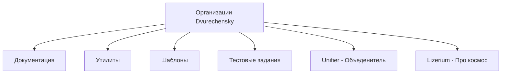
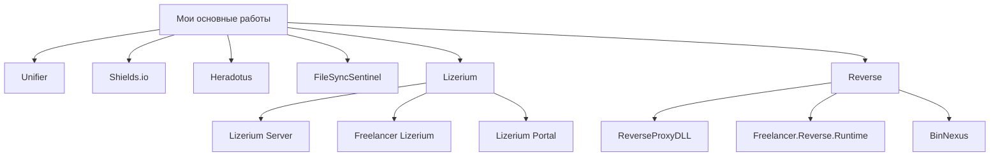
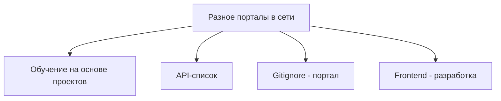
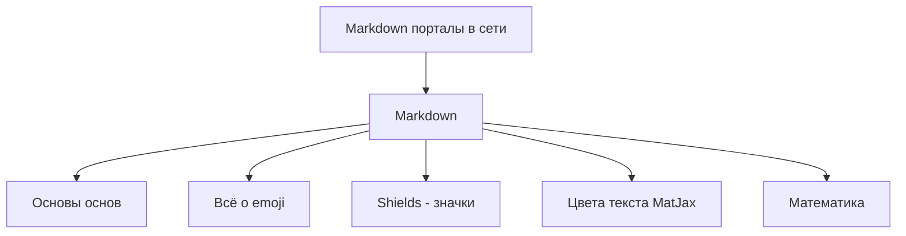
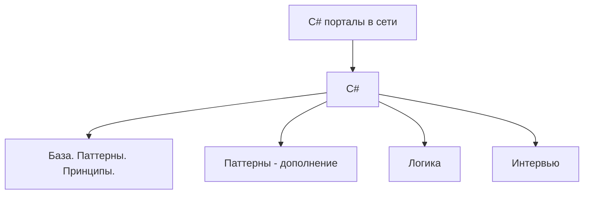
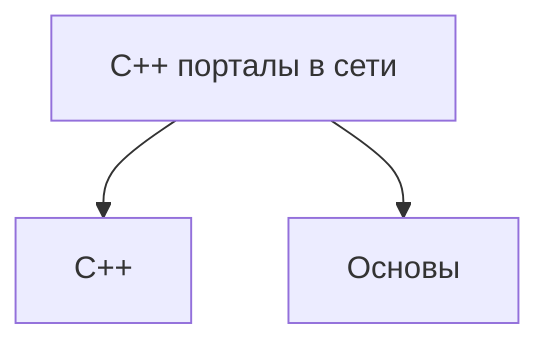
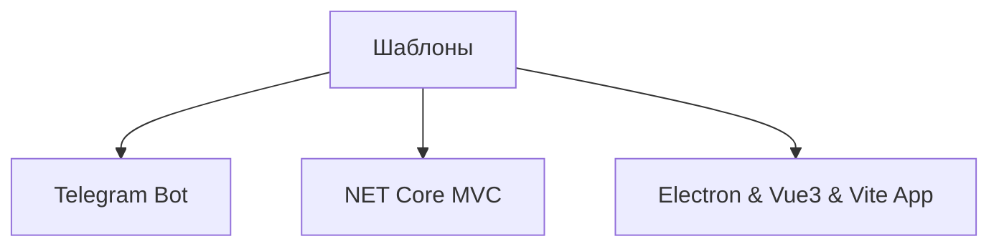

  <strong>🌐 Язык: </strong>
  
  
    ✅ 🇷🇺 Русский (текущий)
  
  | 
  <a href="./README.md" style="color: #0891b2; margin: 0 10px;">
    🇺🇸 English
  </a>

  <picture>
    
  </picture>
  <h2>
  Привет, я Николай Двуреченский 
  Systems Engineer • Reverse Developer • Full Stack Engineer
  </h2>
  <h4>Открыт для <b>сильных</b> команд и <u><b>интересных продуктов</b></u></h4>
  <b>.NET</b> • C/<b>C++</b> • C# • <b><u>Python</u></b> • Unity • TypeScript • <b><u>Reverse</u></b> • Linux • Windows

  

 <h2>
  System Profile
 </h2>

- ••• загрузка профиля...▸
  - [ ◇ ] `Личность`..............▸ Николай Двуреченский
  - [ ◇ ] `Старт`....................▸ Реверс онлайн-игр
  - [ ◇ ] `Опыт`.....................▸ С 2014 года
  - [ ◇ ] `Фокус`..................▸ Системы / Reverse / Full Stack
  - [ ◇ ] `Платформы`........▸ Linux / Windows / Web / Unity
  - [ ◇ ] `Статус`................▸ Открыт для сильных команд
  - [ ✓ ] `Контакты`............▸ [dvurechenskysoft@gmail.com](mailto:dvurechenskysoft@gmail.com) | [nikolay@dvurechensky.pro](mailto:nikolay@dvurechensky.pro)
  - [ ✓ ] `Сайт`.......................▸ [dvurechensky.pro](https://dvurechensky.pro)
  - [ ✓ ] `ORCID`.......................▸ [orcid.org](https://orcid.org/0009-0004-2701-5592)

  

<a href="#организации">Организации</a> ·
<a href="#опыт-работы">Опыт</a> ·
<a href="#технологический-стек">Стек</a>

◇

<a href="#utilities">Утилиты</a> ·
<a href="#focus">Фокус</a>

  

## Организации

<a href="#top">↑ Наверх</a>

<strong>◇ Организации · GitHub <b>(6)</b></strong>

| ⌁ Организация                                                         | ⌁ Описание                                                                                                                                |
| --------------------------------------------------------------------- | ----------------------------------------------------------------------------------------------------------------------------------------- |
| [Dvurechensky Docs](https://github.com/Dvurechensky-Docs)             | Мои разработки или чрезвычайно полезные форки документации, необходимые для повседневной разработки.                                      |
| [Dvurechensky Tools](https://github.com/Dvurechensky-Tools)           | Программы и утилиты, которые я модифицировал или создал с нуля, полезные в различных областях.                                            |
| [Dvurechensky Test Tasks](https://github.com/Dvurechensky-Test-Tasks) | Мой реестр тестовых заданий, выполненных мной бесплатно.                                                                                  |
| [Dvurechensky Templates](https://github.com/Dvurechensky-Templates)   | Мои шаблоны для создания проектов.                                                                                                        |
| [Lizerium](https://github.com/Lizerium)                               | Здесь собраны утилиты для игры Freelancer, созданные или воссозданные мной, проекты - Freelancer Lizerium Unity и модификация Freelancer. |
| [Unifier of Systems](https://github.com/Unifier-of-Systems)           | Унифицирующие сервисы и технологии.                                                                                                       |

| Организация                                                           | Оценка                                                                                                     |
| --------------------------------------------------------------------- | ---------------------------------------------------------------------------------------------------------- |
| [Lizerium](https://github.com/Lizerium)                               |                 |
| [Dvurechensky Tools](https://github.com/Dvurechensky-Tools)           |       |
| [Dvurechensky Docs](https://github.com/Dvurechensky-Docs)             |        |
| [Dvurechensky Test Tasks](https://github.com/Dvurechensky-Test-Tasks) |  |

## Опыт работы

<a href="#top">↑ Наверх</a>

 ◇ Просмотреть опыт работы 

<h4 align="center"><strong>OXSIONSOFT, Lizerium   (Март 2021 – 2026, 5+ лет)</strong></h4>

<i>Unity - разработчик</i>

- Работал над проектом <strong>Ceek Virtual Reality</strong>: разработка функционала, исправление ошибок, редизайн пользовательского интерфейса
   
- Реализовал оптимизацию памяти через <strong>Addressables</strong> → стабильная производительность на Android 7+
   
- Выполнил 3+ крупных эволюции пользовательского интерфейса, мультиплеер на <strong>Photon Engine</strong>, улучшения клиент-серверного API
   
- Писал технические спецификации, сотрудничал между командами
   
- <strong>Стек технологий:</strong> Unity3D, HDRP, VFX Graph, Zenject, Addressables, Blender, Substance, Photoshop, Docker, Photon Engine

  

<h4 align="center"><strong><a href="https://inpsycho.ru/" target="_blank">Московский институт психоанализа (МИП)</a>   (Февраль 2020 – Настоящее время, 6+ лет)</strong></h4>

<i>Технический специалист</i>

- Оказывал техническую поддержку для онлайн видео платформы (MTS-Link)
   
- Помог 1000+ пользователям любого возраста/устройства присоединиться к живым трансляциям
   
- <strong>Стек технологий:</strong> Windows, MacOS

  

<h4 align="center"><strong>NPC Reagent / SIGMA / CMK Consulting   (2019 – 2025, 5+ лет в общей сложности)</strong></h4>

<i>.NET Разработчик</i>

- Создавал <strong>ASP.NET Core MVC</strong> приложения с PostgreSQL, EF Core, RabbitMQ
   
- Разрабатывал системы визуализации для C# / C++ проектов и зависимостей (NuGet)
   
- Мигрировал проекты с .NET Framework → .NET 6/7/8, применял принципы SOLID, DRY, KISS
   
- Проектировал систему мониторинга пентестов (сбор данных, визуализация, аналитика)
   
- Развертывал микросервисы в <strong>Docker</strong>, автоматизировал сборки с Jenkins
   
- <strong>Стек технологий:</strong> C#, ASP.NET Core (6–8), PostgreSQL, RabbitMQ, EF Core, Cytoscape.js, Three.js, Docker, Jenkins, Git, SVN

  

<h4 align="center"><strong>Freelancer Rebirth   (Ноябрь 2020 – Ноябрь 2023, 3 года)</strong></h4>

<i>C++ Разработчик</i>

- Поддерживал крупнейший мод для СНГ для <strong>Freelancer (2003)</strong>
   
- Мигрировал 25+ плагинов и ядро в унифицированное C++ решение
   
- Выполнил 3 крупные миграции проекта между поколениями Visual Studio
   
- <strong>Стек технологий:</strong> C++, Boost, Assembler, Git

  

<h4 align="center"><strong><a href="https://www.inevm.ru/" target="_blank">ИнтерЭВМ</a> & <a href="https://citis.ru/" target="_blank">ЦИТиС</a>   (Февраль 2020 – Июнь 2023, 3+ года)</strong></h4>

<i>Системный инженер</i>

- Разрабатывал системы мониторинга (Qt) и анализаторы данных (Python, PHP)
   
- Создавал XSLT шаблоны, оптимизировал PostgreSQL запросы
   
- Работал с окружениями Astra Linux, Ubuntu, Debian, Windows
   
- <strong>Стек технологий:</strong> Linux (Astra, Ubuntu, Debian), Qt, PHP, Python, SQL, XSLT/XML

  

<h4 align="center"><strong>Другие роли   (2017 – 2020)</strong></h4>

- <strong>ООО Промэлектроника (Липецк)</strong> — Инженер по автоматизации: контроллеры Siemens, SCADA, встраиваемые системы
   
- <strong>ЮрЭксперт (Воронеж)</strong> — Системный администратор: автоматизация рабочих мест, автоматизация документооборота

  

## Технологический стек

<a href="#top">↑ Наверх</a>

 ◇ Открыть технический стек

<h4><strong>◆ Ключевая инженерия</strong></h4>

C#, .NET 3–8, ASP.NET Core (MVC, SignalR), EF Core, Проектирование систем, Full Stack разработка, Reverse Engineering

  

<h4><strong>◆ Backend & Инфраструктура</strong></h4>

RabbitMQ, Redis, PostgreSQL, SQL Server, MySQL, Docker, Jenkins, nginx, Linux (Astra / Ubuntu / Debian / Kali / Parrot OS), Git, SVN, Gitea

  

<h4><strong>◆ Frontend & Desktop UI</strong></h4>

TypeScript, Cytoscape.js, Three.js, Webpack, Grunt, Prism (MVVM WPF), HandyControl (WPF), HTML5, SCSS/CSS, Markdown

  

<h4><strong>◆ Game Development</strong></h4>

Unity (HDRP / URP), Zenject, Addressables, Photon, Object Pooling, ECS (Leo / Unity / Custom), Blender, Substance Painter, Photoshop

  

<h4><strong>◆ Языки & Низкий уровень</strong></h4>

Python, Go, PHP, C, C++, C#, ASM x86, Shell, Bash, Qt, Boost, Elixir, Fortran77

  

<h4><strong>◆ Тестирование & Диагностика</strong></h4>

xUnit, nUnit, Интеграционное тестирование, IDA Pro, OllyDbg, Burp Suite Pro

  

### Утилиты

<a href="#top">↑ Наверх</a>

 

<strong>◇ Самые важные · проекты <b>(11)</b></strong>

#### ◇ Самые важные · проекты

<a href="#top">↑ Наверх</a>

<table>
  <thead>
    <tr>
      <th>⌁ Проект</th>
      <th>⌁ Описание</th>
      <th>Языки</th>
    </tr>
  </thead>
  <tbody>
    <tr>
      <td data-label="Проект"><a href="https://github.com/Dvurechensky/BinNexus">BinNexus</a></td>
      <td data-label="Описание">BinNexus — инструмент для анализа бинарников Windows (DLL / EXE), который строит интерактивный веб-портал с графом зависимостей и исследованием экспортов.</td>
      <td data-label="Языки"><code>Python · JavaScript · CSS · HTML · C++</code></td>
    </tr>
    <tr>
      <td data-label="Проект"><a href="https://github.com/Dvurechensky/ReverseProxyDLL">ReverseProxyDLL</a></td>
      <td data-label="Описание">Генератор reverse-aware proxy DLL каркасов для legacy x86 Windows-бинарников на основе дампа экспортов и вывода декомпилятора.</td>
      <td data-label="Языки"><code>Python · C++</code></td>
    </tr>
    <tr>
      <td data-label="Проект"><a href="https://github.com/Dvurechensky/Freelancer.Reverse.Runtime">Freelancer.Reverse.Runtime</a></td>
      <td data-label="Описание">Я строю runtime-слой поверх Freelancer (2003), восстанавливая и переопределяя системные DLL, чтобы безопасно исследовать, расширять и документировать поведение оригинального движка.</td>
      <td data-label="Языки"><code>C · C++ · Batchfile · Asm x86 · Ghidra · x32dbg</code></td>
    </tr>
    <tr>
      <td data-label="Проект"><a href="https://lizup.ru/">Lizerium Portal</a></td>
      <td data-label="Описание">Разработанный мной портал для <code>космического</code> <code>симулятора</code> — это огромный портал под игру с базой знаний о игре <code>Freelancer (2003)</code>.</td>
      <td data-label="Языки"><code>ASP Net Core 6.0 · MVC · TypeScript · EF Core</code></td>
    </tr>
    <tr>
      <td data-label="Проект"><a href="https://lizup.ru/Home/Game">Freelancer Lizerium</a></td>
      <td data-label="Описание">Разработанный мной <code>космический</code> <code>симулятор</code> — это моя игра в жанре <code>космические симуляторы</code> на базе <code>Freelancer (2003)</code> (Мультиплеер и одиночный режим).</td>
      <td data-label="Языки"><code>C++ · Assembler x86</code></td>
    </tr>
    <tr>
      <td data-label="Проект">
        <a href="https://lizup.ru/Home/Game">Lizerium Server</a> | 
        <a href="https://www.gs4u.net/ru/s/398133.html">GS4u.net — Мониторинг игровых серверов</a>
      </td>
      <td data-label="Описание">Разработанный мной сервер на <code>космический</code> <code>симулятор</code> <a href="https://lizup.ru/Home/Game">Freelancer Lizerium</a> — это огромное дополнение, которое состоит из 50+ плагинов, импортирующих новые функции в игровой процесс.</td>
      <td data-label="Языки"><code>C++ · Asm x86</code></td>
    </tr>
    <tr>
      <td data-label="Проект"><a href="https://lizup.ru/Home/Game">Lizerium Steam</a></td>
      <td data-label="Описание">Разработанный мной <code>загрузчик игр</code> серии Freelancer — это технически всем известный <code>Steam</code> по своему <code>поведению</code>, и он может <code>портировать</code> и <code>обновлять</code> содержимое и <code>сам себя</code>.</td>
      <td data-label="Языки"><code>WPF · Prism MVVM · Handy Control</code></td>
    </tr>
    <tr>
      <td data-label="Проект"><a href="https://github.com/Dvurechensky-Tools/Heradotus">Heradotus</a></td>
      <td data-label="Описание">Ваш <code>конструктор</code> <code>сценариев</code> для презентаций и демонстраций. Для разработчиков, понимающих <code>Markdown</code>.</td>
      <td data-label="Языки"><code>WPF · Prism MVVM · Handy Control</code></td>
    </tr>
    <tr>
      <td data-label="Проект"><a href="https://github.com/Dvurechensky-Tools/FileSyncSentinel">FileSyncSentinel</a></td>
      <td data-label="Описание">Мощный <code>мониторинг</code> изменений файлов в реальном времени с интеллектуальным <code>сравнением</code> 🔍.</td>
      <td data-label="Языки"><code>WinForms · MVC · DiffPlex · .NET 8.0</code></td>
    </tr>
    <tr>
      <td data-label="Проект"><a href="https://shields.dvurechensky.pro/">Русский Shields.io</a></td>
      <td data-label="Описание">Генератор красивых бейджей на русском языке.</td>
      <td data-label="Языки"><code>JS/TS · Canvas / WebGL · Node JS · Redis</code></td>
    </tr>
    <tr>
      <td data-label="Проект"><a href="https://unifier.dvurechensky.pro/">Unifier</a></td>
      <td data-label="Описание">Зарегистрированная программная система для распределенного взаимодействия устройств и оркестровки инфраструктуры.<a href="https://github.com/Dvurechensky/Dvurechensky/blob/main/Media/files/Unifier.Patent.pdf" target="_blank">📄 Патент</a></td>
      <td data-label="Языки"><code>JS/TS · .NET 8.0 · Tree JS · Rabbit MQ · PostgreSQL</code></td>
    </tr>
  </tbody>
</table>

 

<strong>◇ Интернет-порталы · от меня <b>(14)</b></strong>

#### ◇ Разное · GitHub

| ⌁ Проект                                                                                 | ⌁ Описание                                                                                                                                                               |
| ---------------------------------------------------------------------------------------- | ------------------------------------------------------------------------------------------------------------------------------------------------------------------------ |
| [Обучение на основе проектов](https://dvurechensky-docs.github.io/ProjectBasedLearning/) | Ccылки на ресурсы по категориям языков программирования для обучения                                                                                                     |
| [API-список](https://dvurechensky-docs.github.io/Internet/)                              | Каталог открытых API по категориям                                                                                                                                       |
| [Gitignore - портал](https://dvurechensky-docs.github.io/Gitignore/)                     | Коллекция готовых `.gitignore` + экскурсия по технологиям                                                                                                                |
| [Frontend - разработка](https://dvurechensky-docs.github.io/WebFrontendKnowledge/)       | Постоянно расширяющийся список фреймворков, библиотек и инструментов, которые я использовал/хочу использовать для создания `Web-контента`. В основном, это `JavaScript`. |

  

#### ◇ Markdown · GitHub

<a href="#top">↑ Наверх</a>

| ⌁ Проект                                                                                 | ⌁ Описание                                  |
| ---------------------------------------------------------------------------------------- | ------------------------------------------- |
| [Markdown основы основ](https://dvurechensky-docs.github.io/GeneralDocsMarkdown/)        | Полное руководство по Markdown с лайфхаками |
| [Emoji в Markdown](https://dvurechensky-docs.github.io/EmojiCollectionsMarkdown/)        | Коллекция Emoji                             |
| [Список значков Shields](https://dvurechensky-docs.github.io/ShieldsMarkdown/)           | Коллекция значков Shields                   |
| [Цвета текста через MathJax](https://dvurechensky-docs.github.io/MathJaxColorsMarkdown/) | Примеры цветного текста                     |
| [Математика в Markdown](https://dvurechensky-docs.github.io/MathMarkdown/)               | Пример реализации математических формул     |

  

#### ◇ C# · GitHub

<a href="#top">↑ Наверх</a>

| ⌁ Проект                                                                                                                   | ⌁ Описание                                                                                                                                                                     |
| -------------------------------------------------------------------------------------------------------------------------- | ------------------------------------------------------------------------------------------------------------------------------------------------------------------------------ |
| [Разбор языка программирования C#.](https://dvurechensky-docs.github.io/BasicKnowledgeCSharp/)                             | Обзор функционала языка програмиирования C#, решение задач.                                                                                                                    |
| [Шаблоны проектирования. ООП. Тестирование. Коллекции C#.](https://dvurechensky-docs.github.io/PatternsCSharpProgramming/) | Основы объектно-ориентированного программирования, а также шаблоны программирования в C# с примерами их реализации, тестирование, объянение принципов и решение задач LetCode. |
| [Паттерны (дополнение) C#](https://dvurechensky-docs.github.io/PatternsCSharpExtraAddons/)                                 | Образцы, шаблоны, схемы программирования в C# с примерами их реализации                                                                                                        |
| [Вопросы на собеседованиях по C# (NET)](https://dvurechensky-docs.github.io/InterviewCSharpNet/)                           | Обзор вопросов по языку программирования C# и технологии .NET                                                                                                                  |

  

#### ◇ C++ · GitHub

<a href="#top">↑ Наверх</a>

| ⌁ Проект                                                                                        | ⌁ Описание                                                   |
| ----------------------------------------------------------------------------------------------- | ------------------------------------------------------------ |
| [Разбор 🚏 языка программирования C++.](https://dvurechensky-docs.github.io/BasicKnowledgeCPP/) | Обзор функционала языка програмиирования C++, решение задач. |

 

<strong>◇ Шаблоны <b>(3)</b></strong>

#### ◇ Шаблоны

<a href="#top">↑ Наверх</a>

| ⌁ Проект                                                                                                  | ⌁ Описание                                                                                                                                    |
| --------------------------------------------------------------------------------------------------------- | --------------------------------------------------------------------------------------------------------------------------------------------- |
| [Telegram Bot 🚏 Шаблон.](https://github.com/Dvurechensky-Templates/TelegramBotTemplate)                  | Чистая, многоуровневая архитектура. Легко масштабируется и добавляет новые команды/сервисы.                                                   |
| [Net Core 🚏 Шаблон.](https://github.com/Dvurechensky-Templates/NetCoreTemplate)                          | ASP.NET Core MVC, шаблон проекта Frontend — TypeScript                                                                                        |
| [Electron & Vue3 & Vite 🚏 Template.](https://github.com/Dvurechensky-Templates/ElectronViteTemplateRuEn) | Шаблон проекта Vue3 + Vite + Electron, основанный на Vite и Rollup. альтернативный платформер для производства кроссплатформенных приложений. |

  

## Фокус

<a href="#top">↑ Наверх</a>

- [ ◇ ] Системы автоматизации и обратное проектирование
- [ ◇ ] Инструменты .NET для Windows/Linux
- [ ◇ ] Рост экосистемы GitHub
- [ ◇ ] Возможности для разработки продуктов

  

  
  

  

    
    &nbsp;
    
    &nbsp;
    
    &nbsp;
    
    &nbsp;
    
    &nbsp;
    
    &nbsp;
    
  

  

`Псевдонимы в сети:` **Dvurechensky** · **dvurechensky_pro** · **Dvurechensky Media** · **Dormammu Media** · **Rota**

  

<!-- Donationes -->

<table align="center" style="border-collapse: collapse; min-width: 300px; width: 100%;">
<tr>
    <td colspan="3" align="center">
    <b>💚 Спасибо за вашу поддержку! Вы можете сделать пожертвование, используя информацию ниже. 🙏</b>
    </td>
</tr>
<tr>
    <th style="padding: 8px; text-align: center;">Платежи</th>
    <th style="padding: 8px; text-align: center;">Адрес</th>
    <th style="padding: 8px; text-align: center;">QR-код</th>
</tr>
<tr>
    <td style="padding: 8px; text-align: center;">
    
    </td>
    <td style="padding: 8px; text-align: center;"><code>bc1qlrqjhdeqtzd0dnvw7lj0gc0r8kke8m8rc7dxym</code></td>
    <td style="padding: 8px; text-align: center;"></td>
</tr>
<tr>
    <td style="padding: 8px; text-align: center;">
    
    </td>
    <td style="padding: 8px; text-align: center;"><code>dvurechensky_pro</code></td>
    <td style="padding: 8px; text-align: center;"></td>
</tr>
</table>

  

> 2026
