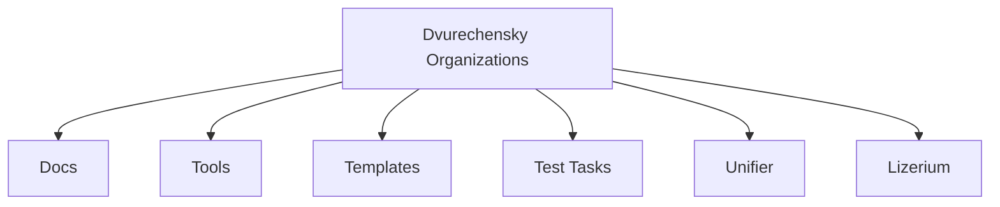
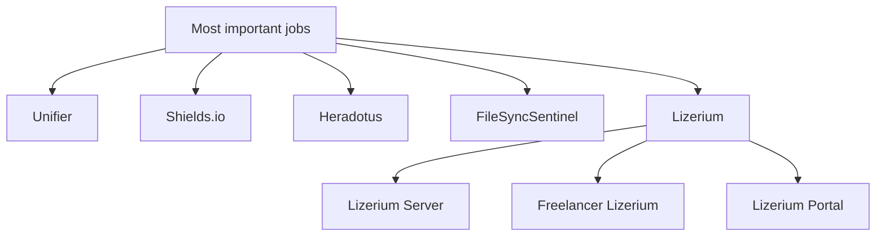
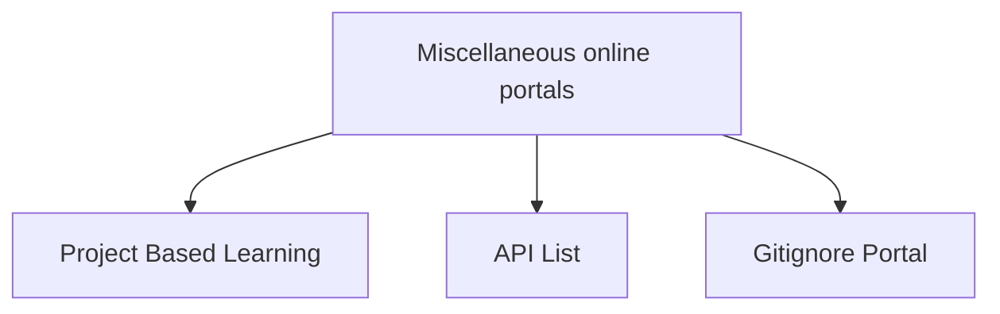
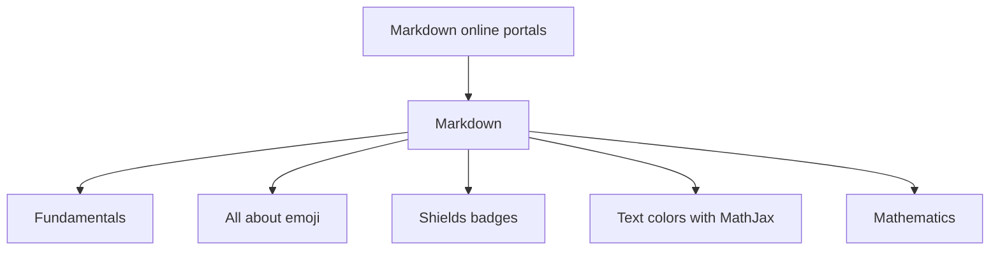
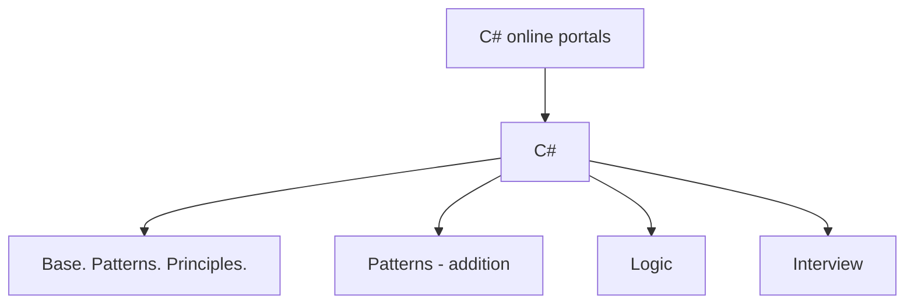
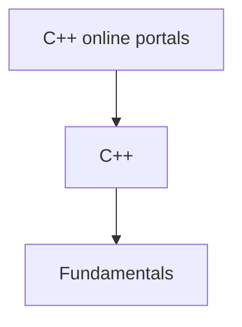
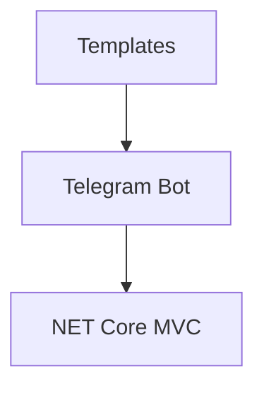

  <strong>🌐 Language: </strong>
  
  <a href="./README.md" style="color: #F5F752; margin: 0 10px;">
    🇷🇺 Russian
  </a>
  | 
  
    ✅ 🇺🇸 English (current)
  

  <picture>
    
  </picture>
  <h2>👋 Hi there, I'm Nikolai Dvurechensky  💻 A passionate Full Stack Developer</h2>

    

> 🎯 `Reverse` Engineer · Full-stack & `Unity` Developer · `.NET` Enthusiast
> 🌌 `Universal` programmer exploring **`Web` · `Unity` · `Linux` · `Security`**

- [🚀 About Me](#-about-me)
- [🌌 Projects · Utilities · Organizations](#-projects--utilities--organizations)
  - [Projects · Utilities 🐠](#projects--utilities-)
    - [Most important jobs 🌌](#most-important-jobs-)
    - [📚 Miscellaneous · GitHub](#-miscellaneous--github)
    - [📚 Markdown · GitHub](#-markdown--github)
    - [📚 C# · GitHub](#-c--github)
    - [📚 C++ · GitHub](#-c--github-1)
    - [📚 Templates](#-templates)
- [💼 Experience](#-experience)
- [🛠️ Tech Stack](#️-tech-stack)
- [🧠 Current Focus](#-current-focus)

## 🚀 About Me

- 💻 Started programming with reverse engineering of online games
- 🛠️ Creating automation tools, game clients, and backend systems since 2014
- 🌍 Based in **Moscow**
- 🎨 Passionate about **.NET, reverse engineering, Unity HDRP, Linux, security, and experimental projects, proficient in almost all popular programming languages**
- ⚡ Fun fact: I call myself a hacker — but in the good sense, completed a white hat hacking course from `CyberEd` 😉

📫 Reach me: [dvurechenskysoft@gmail.com](mailto:dvurechenskysoft@gmail.com)
🌐 Portfolio: [dvurechensky.pro](https://sites.google.com/view/dvurechensky)

## 🌌 Projects · Utilities · Organizations

<strong>🐌 Organizations GitHub (6)</strong>

| 🔗 Project                                                            | 📖 Description                                                                                                                                                   |
| --------------------------------------------------------------------- | ---------------------------------------------------------------------------------------------------------------------------------------------------------------- |
| [Dvurechensky Docs](https://github.com/Dvurechensky-Docs)             | My developments or extremely useful forks of documentation necessary for daily development.                                                                      |
| [Dvurechensky Tools](https://github.com/Dvurechensky-Tools)           | Programs and utilities that I modified or created from scratch, useful in different areas.                                                                       |
| [Dvurechensky Test Tasks](https://github.com/Dvurechensky-Test-Tasks) | My register of test tasks completed by me free of charge.                                                                                                        |
| [Dvurechensky Templates](https://github.com/Dvurechensky-Templates)   | My templates for creating projects.                                                                                                                              |
| [Lizerium](https://github.com/Lizerium)                               | Here are collected utilities for the game Freelancer, created or recreated by Dvurechensky, projects - Freelancer Lizerium Unity and modification of Freelancer. |
| [Unifier of Systems](https://github.com/Unifier-of-Systems)           | Unifying services and technology.                                                                                                                                |

### Projects · Utilities 🐠

 

<strong>Most important jobs 💼 (8)</strong>

#### Most important jobs 🌌

<table>
  <thead>
    <tr>
      <th>🔗 Project</th>
      <th>📖 Description</th>
      <th>Lang</th>
    </tr>
  </thead>
  <tbody>
    <tr>
      <td data-label="Project"><a href="https://lizup.ru/">Lizerium Portal</a></td>
      <td data-label="Description">My developed portal for a <code>space</code> <code>simulator</code> — this is a huge portal for the game with a knowledge base about the game <code>Freelancer (2003)</code>.</td>
      <td data-label="Lang"><code>ASP Net Core 6.0 · MVC · TypeScript · EF Core</code></td>
    </tr>
    <tr>
      <td data-label="Project"><a href="https://lizup.ru/Home/Game">Freelancer Lizerium</a></td>
      <td data-label="Description">My developed <code>space</code> <code>simulator</code> — this is my game in the <code>space simulators</code> genre based on <code>Freelancer (2003)</code> (Multiplayer and single player modes).</td>
      <td data-label="Lang"><code>C++ · Assembler x86</code></td>
    </tr>
    <tr>
      <td data-label="Project">
        <a href="https://lizup.ru/Home/Game">Lizerium Server</a> | 
        <a href="https://www.gs4u.net/ru/s/398133.html">GS4u.net - Game Server Monitoring</a>
      </td>
      <td data-label="Description">My developed server for the <code>space</code> <code>simulator</code> <a href="https://lizup.ru/Home/Game">Freelancer Lizerium</a> — this is a huge expansion that consists of 50+ plugins importing new functions into the gameplay.</td>
      <td data-label="Lang"><code>C++ · Asm x86</code></td>
    </tr>
    <tr>
      <td data-label="Project"><a href="https://lizup.ru/Home/Game">Lizerium Steam</a></td>
      <td data-label="Description">My developed <code>game loader</code> for the Freelancer series — this is technically the well-known <code>Steam</code> in its <code>behavior</code> and it can <code>port</code> and <code>update</code> what's inside it and <code>itself</code>.</td>
      <td data-label="Lang"><code>WPF · Prism MVVM · Handy Control</code></td>
    </tr>
    <tr>
      <td data-label="Project"><a href="https://github.com/Dvurechensky-Tools/Heradotus">Heradotus</a></td>
      <td data-label="Description">Your <code>scenario</code> <code>constructor</code> for presentations and demonstrations. For developers who understand <code>Markdown</code>.</td>
      <td data-label="Lang"><code>WPF · Prism MVVM · Handy Control</code></td>
    </tr>
    <tr>
      <td data-label="Project"><a href="https://github.com/Dvurechensky-Tools/FileSyncSentinel">FileSyncSentinel</a></td>
      <td data-label="Description">Powerful real-time file change <code>monitoring</code> with intelligent <code>comparison</code> 🔍.</td>
      <td data-label="Lang"><code>WinForms · MVC · DiffPlex · NET 8.0</code></td>
    </tr>
    <tr>
      <td data-label="Project"><a href="https://shields.dvurechensky.pro/">Russian Shields.io</a></td>
      <td data-label="Description">Beautiful badge generator in Russian language.</td>
      <td data-label="Lang"><code>JS/TS · Canvas / WebGL · Node JS · Redis</code></td>
    </tr>
    <tr>
      <td data-label="Project"><a href="https://unifier.dvurechensky.pro/">Unifier</a></td>
      <td data-label="Description">Demonstration of operating systems, their process graphs, device management system.</td>
      <td data-label="Lang"><code>JS/TS · NET 8.0 · Tree JS · Rabbit MQ · PostgreSQL</code></td>
    </tr>
  </tbody>
</table>

 

<strong>Internet portals from me 📚 (13)</strong>

#### 📚 Miscellaneous · GitHub

| 🔗 Project                                                                          | 📖 Description                                                     |
| ----------------------------------------------------------------------------------- | ------------------------------------------------------------------ |
| [Project Based Learning](https://dvurechensky-docs.github.io/ProjectBasedLearning/) | Links to resources by programming language categories for learning |
| [API List](https://dvurechensky-docs.github.io/Internet/)                           | Catalog of open APIs by categories                                 |
| [Gitignore Portal](https://dvurechensky-docs.github.io/Gitignore/)                  | Collection of ready `.gitignore` files + technology overview       |

#### 📚 Markdown · GitHub

| 🔗 Project                                                                            | 📖 Description                                  |
| ------------------------------------------------------------------------------------- | ----------------------------------------------- |
| [Markdown Docs](https://dvurechensky-docs.github.io/GeneralDocsMarkdown/)             | Complete Markdown guide with lifehacks          |
| [Emoji in Markdown](https://dvurechensky-docs.github.io/EmojiCollectionsMarkdown/)    | Emoji collection                                |
| [Shields Badges List](https://dvurechensky-docs.github.io/ShieldsMarkdown/)           | Collection of Shields badges                    |
| [Text Colors via MathJax](https://dvurechensky-docs.github.io/MathJaxColorsMarkdown/) | Examples of colored text                        |
| [Mathematics in Markdown](https://dvurechensky-docs.github.io/MathMarkdown/)          | Example implementation of mathematical formulas |

#### 📚 C# · GitHub

| 🔗 Project                                                                                                       | 📖 Description                                                                                                                                                                              |
| ---------------------------------------------------------------------------------------------------------------- | ------------------------------------------------------------------------------------------------------------------------------------------------------------------------------------------- |
| [Analysis of the C# programming language.](https://dvurechensky-docs.github.io/BasicKnowledgeCSharp/)            | Overview of the C# programming language functionality, problem solving.                                                                                                                     |
| [Design Patterns. OOP. Testing. C# Collections.](https://dvurechensky-docs.github.io/PatternsCSharpProgramming/) | Fundamentals of object-oriented programming, as well as programming patterns in C# with examples of their implementation, testing, explanation of principles and solving LeetCode problems. |
| [Patterns (addition) C#](https://dvurechensky-docs.github.io/PatternsCSharpExtraAddons/)                         | Samples, templates, programming schemes in C# with examples of their implementation                                                                                                         |
| [Interview Questions on C# (NET)](https://dvurechensky-docs.github.io/InterviewCSharpNet/)                       | Overview of questions on the C# programming language and .NET technology                                                                                                                    |

#### 📚 C++ · GitHub

| 🔗 Project                                                                                             | 📖 Description                                                           |
| ------------------------------------------------------------------------------------------------------ | ------------------------------------------------------------------------ |
| [Analysis 🚏 of the C++ programming language.](https://dvurechensky-docs.github.io/BasicKnowledgeCPP/) | Overview of the C++ programming language functionality, problem solving. |

 

<strong>Templates 📚 (2)</strong>

#### 📚 Templates

| 🔗 Project                                                                                 | 📖 Description                                                                 |
| ------------------------------------------------------------------------------------------ | ------------------------------------------------------------------------------ |
| [Telegram Bot 🚏 Template.](https://github.com/Dvurechensky-Templates/TelegramBotTemplate) | Clean, multi-layered architecture. Easy to scale and add new teams / services. |
| [Net Core 🚏 Template.](https://github.com/Dvurechensky-Templates/NetCoreTemplate)         | ASP.NET Core MVC, Frontend Project Template - TypeScript                       |

  

## 💼 Experience

 Open 

<h4 align="center"><strong>OXSIONSOFT, Lizerium   (Mar 2021 – Present, 4+ years)</strong></h4>

<i>Unity Developer</i>

- Worked on <strong>Ceek Virtual Reality</strong> project: feature development, bug fixing, UI redesigns
   
- Implemented memory optimization via <strong>Addressables</strong> → stable performance on Android 7+
   
- Delivered 3+ major UI evolutions, multiplayer on <strong>Photon Engine</strong>, client-server API improvements
   
- Wrote technical specifications, collaborated across teams
   
- <strong>Stack:</strong> Unity3D, HDRP, VFX Graph, Zenject, Addressables, Blender, Substance, Photoshop, Docker, Photon Engine

<h4 align="center"><strong>Moscow Institute of Psychoanalysis (MIP)   (Feb 2020 – Present, 5+ years)</strong></h4>

<i>Technical Specialist</i>

- Provided technical support for online video platform (MTS-Link)
   
- Helped 1000+ users of any age/device join live broadcasts
   
- <strong>Stack:</strong> Windows, MacOS

<h4 align="center"><strong>NPC Reagent / SIGMA / CMK Consulting   (2019 – 2025, 5+ years total)</strong></h4>

<i>.NET Developer</i>

- Built <strong>ASP.NET Core MVC</strong> apps with PostgreSQL, EF Core, RabbitMQ
   
- Developed visualization systems for C# / C++ projects and dependencies (NuGet)
   
- Migrated projects across .NET Framework → .NET 6/7/8, applied SOLID, DRY, KISS principles
   
- Designed pentest monitoring system (data collection, visualization, analytics)
   
- Deployed microservices in <strong>Docker</strong>, automated builds with Jenkins
   
- <strong>Stack:</strong> C#, ASP.NET Core (6–8), PostgreSQL, RabbitMQ, EF Core, Cytoscape.js, Three.js, Docker, Jenkins, Git, SVN

<h4 align="center"><strong>Freelancer Rebirth   (Nov 2020 – Nov 2023, 3 years)</strong></h4>

<i>C++ Developer</i>

- Maintained the largest CIS mod for <strong>Freelancer (2003)</strong>
   
- Migrated 25+ plugins & core into unified C++ solution
   
- Performed 3 major project migrations across Visual Studio generations
   
- <strong>Stack:</strong> C++, Boost, Assembler, Git

<h4 align="center"><strong>InterEVM   (Feb 2020 – Jun 2023, 3+ years)</strong></h4>

<i>System Engineer</i>

- Developed monitoring systems (Qt) and data analyzers (Python, PHP)
   
- Built XSLT templates, optimized PostgreSQL queries
   
- Worked with Astra Linux, Ubuntu, Debian, Windows environments
   
- <strong>Stack:</strong> Linux (Astra, Ubuntu, Debian), Qt, Python, SQL, XSLT/XML

<h4 align="center"><strong>Other Roles   (2017 – 2020)</strong></h4>

- <strong>Promelektronika</strong> — Automation engineer: Siemens controllers, SCADA, embedded systems
   
- <strong>YurExpert</strong> — SysAdmin: workplace automation, document automation

## 🛠️ Tech Stack

 Open 

<h4><strong>Backend:</strong></h4>
C#, .NET 3–8, ASP.NET Core (MVC, SignalR), EF Core, RabbitMQ, Redis, Prism (MVVM WPF), Elixir

<h4><strong>Frontend:</strong></h4>
TypeScript, Cytoscape.js, Three.js, Webpack, Grunt, HandyContol(WPF)

<h4><strong>Tested:</strong></h4>
xUnit, nUnit, Integrated

<h4><strong>GameDev:</strong></h4>
Unity (HDRP/URP, Zenject, Addressables, Photon, Object Pooling), ECS (Leo / Unity / Custom), Blender, Substance Painter, Photoshop

<h4><strong>Databases:</strong></h4>
PostgreSQL, SQL Server, Redis, MySQL, EF Core

<h4><strong>DevOps:</strong></h4>
Linux (Astra, Ubuntu, Debian, Kali, Parrot OS), Docker, Jenkins, nginx, Git, SVN, Gitea

<h4><strong>Languages & Tools:</strong></h4>
Python, Си, С++, С#, PHP, Go, Asm x86, Fortran77, Markdown, Shell, HTML5, SCSS/CSS, Boost, Qt, Bash, IDA Pro, OllyDbg, Burp Suite Pro

## 🧠 Current Focus

- Cross-platform tools on .NET 8 / Linux
- Expanding open-source utilities & documentation portals

`Псевдонимы в сети:` **Dvurechensky** · **dvurechensky_pro** · **Dvurechensky Media** · **Dormammu Media** · **Rota**

    

        

        
    
 
    
 

<!-- Donationes -->

<table align="center" style="border-collapse: collapse; min-width: 300px; width: 100%;">
<tr>
    <td colspan="3" align="center">
    <b>💚 Thank you for your support! You can donate using the info below 🙏</b>
    </td>
</tr>
<tr>
    <th style="padding: 8px; text-align: center;">Payments</th>
    <th style="padding: 8px; text-align: center;">Address</th>
    <th style="padding: 8px; text-align: center;">QR Code</th>
</tr>
<tr>
    <td style="padding: 8px; text-align: center;">
    
    </td>
    <td style="padding: 8px; text-align: center;"><code>bc1qlrqjhdeqtzd0dnvw7lj0gc0r8kke8m8rc7dxym</code></td>
    <td style="padding: 8px; text-align: center;"></td>
</tr>
<tr>
    <td style="padding: 8px; text-align: center;">
    
    </td>
    <td style="padding: 8px; text-align: center;"><code>dvurechensky_pro</code></td>
    <td style="padding: 8px; text-align: center;"></td>
</tr>
</table>

> 2025
