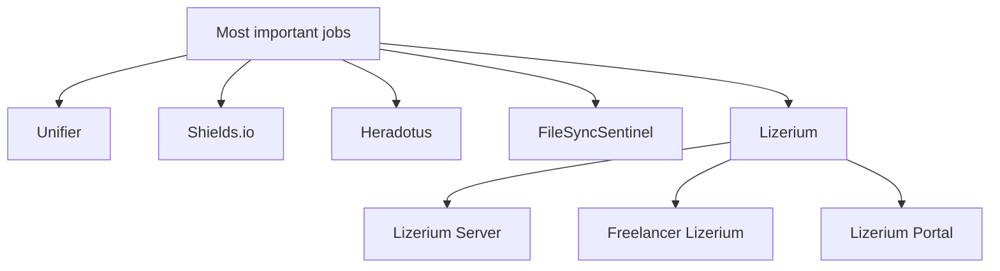
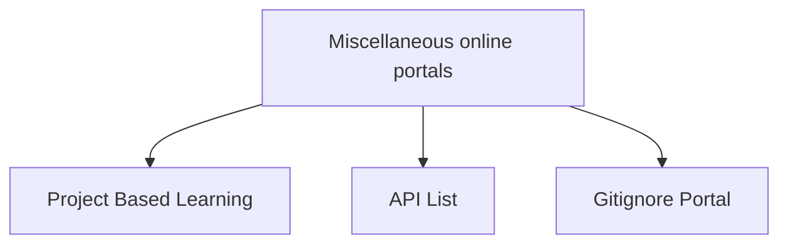
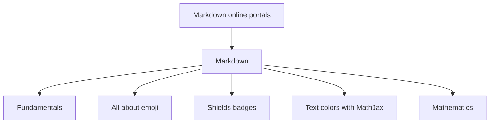
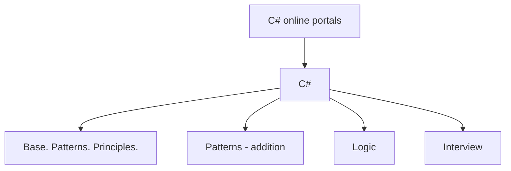
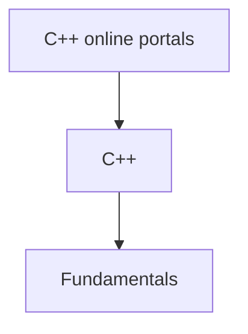

  <strong>🌐 Language: </strong>
  
  <a href="/Dvurechensky" style="color: #F5F752; margin: 0 10px;">
    🇷🇺 Russian
  </a>
  | 
  
    ✅ 🇺🇸 English (current)
  

  <picture>
    
  </picture>
  <h2>👋 Hi there, I'm Nikolai Dvurechensky  💻 A passionate Full Stack Developer</h2>

    

> 🎯 `Reverse` Engineer · Full-stack & `Unity` Developer · `.NET` Enthusiast
> 🌌 `Universal` programmer exploring **`Web` · `Unity` · `Linux` · `Security`**

- [🚀 About Me](#-about-me)
- [🌌 Projects · Utilities · Organizations](#-projects--utilities--organizations)
  - [Projects · Utilities 🐠](#projects--utilities-)
    - [Most important jobs 🌌](#most-important-jobs-)
    - [📚 Miscellaneous · GitHub](#-miscellaneous--github)
    - [📚 Markdown · GitHub](#-markdown--github)
    - [📚 C# · GitHub](#-c--github)
    - [📚 C++ · GitHub](#-c--github-1)
- [💼 Experience](#-experience)
- [🛠️ Tech Stack](#️-tech-stack)
- [🧠 Current Focus](#-current-focus)

## 🚀 About Me

- 💻 Started programming with reverse engineering of online games
- 🛠️ Creating automation tools, game clients, and backend systems since 2014
- 🌍 Based in **Moscow**
- 🎨 Passionate about **.NET, reverse engineering, Unity HDRP, Linux, security, and experimental projects, proficient in almost all popular programming languages**
- ⚡ Fun fact: I call myself a hacker — but in the good sense, completed a white hat hacking course from `CyberEd` 😉

📫 Reach me: [dvurechenskysoft@gmail.com](mailto:dvurechenskysoft@gmail.com)
🌐 Portfolio: [dvurechensky.pro](https://sites.google.com/view/dvurechensky)

## 🌌 Projects · Utilities · Organizations

<strong>🌠Organizations GitHub (6)</strong>

| 🔗 Project                                                            | 📖 Description                                                                                                                                                   |
| --------------------------------------------------------------------- | ---------------------------------------------------------------------------------------------------------------------------------------------------------------- |
| [Dvurechensky Docs](https://github.com/Dvurechensky-Docs)             | My developments or extremely useful forks of documentation necessary for daily development.                                                                      |
| [Dvurechensky Tools](https://github.com/Dvurechensky-Tools)           | Programs and utilities that I modified or created from scratch, useful in different areas.                                                                       |
| [Dvurechensky Test Tasks](https://github.com/Dvurechensky-Test-Tasks) | My register of test tasks completed by me free of charge.                                                                                                        |
| [Dvurechensky Templates](https://github.com/Dvurechensky-Templates)   | My templates for creating projects.                                                                                                                              |
| [Lizerium](https://github.com/Lizerium)                               | Here are collected utilities for the game Freelancer, created or recreated by Dvurechensky, projects - Freelancer Lizerium Unity and modification of Freelancer. |
| [Unifier of Systems](https://github.com/Unifier-of-Systems)           | Unifying services and technology.                                                                                                                                |

### Projects · Utilities 🐠

 

<strong>Most important jobs 💼 (8)</strong>

#### Most important jobs 🌌

| 🔗 Project                                                                                                                  | 📖 Description                                                                                                                                                                                      | Lang                                                 |
| --------------------------------------------------------------------------------------------------------------------------- | --------------------------------------------------------------------------------------------------------------------------------------------------------------------------------------------------- | ---------------------------------------------------- |
| [Lizerium Portal](https://lizup.ru/)                                                                                        | My developed portal for a `space` `simulator` - this is a huge portal for the game with a knowledge base about the game `Freelancer (2003)`                                                         | `ASP Net Core 6.0 · MVC · TypeScript · EF Core `     |
| [Freelancer Lizerium](https://lizup.ru/Home/Game)                                                                           | My developed `space` `simulator` - this is my game in the `space simulators` genre based on `Freelancer (2003)` (Multiplayer and single player modes)                                               | `C++ · Assembler x86`                                |
| [Lizerium Server](https://lizup.ru/Home/Game) \| [GS4u.net - Game Server Monitoring](https://www.gs4u.net/ru/s/398133.html) | My developed server for the `space` `simulator` [Freelancer Lizerium](https://lizup.ru/Home/Game) - this is a huge expansion that consists of 50+ plugins importing new functions into the gameplay | `C++ · Asm x86`                                      |
| [Lizerium Steam](https://lizup.ru/Home/Game)                                                                                | My developed `game loader` for the Freelancer series - this is technically the well-known `Steam` in its `behavior` and it can `port` and `update` what's inside it and `itself`.                   | `WPF · Prism MVVM  · Handy Control`                  |
| [Heradotus](https://github.com/Dvurechensky-Tools/Heradotus)                                                                | Your `scenario` `constructor` for presentations and demonstrations. For developers who understand `Markdown`.                                                                                       | `WPF · Prism MVVM  · Handy Control`                  |
| [FileSyncSentinel](https://github.com/Dvurechensky-Tools/FileSyncSentinel)                                                  | Powerful real-time file change `monitoring` with intelligent `comparison` 🔍.                                                                                                                       | `WinForms · MVC  · DiffPlex · NET 8.0 `              |
| [Russian Shields.io](https://shields.dvurechensky.pro/)                                                                     | Beautiful badge generator in Russian language                                                                                                                                                       | `JS/TS · Canvas / WebGL · Node JS · Redis`           |
| [Unifier](https://unifier.dvurechensky.pro/)                                                                                | Demonstration of operating systems, their process graphs, device management system                                                                                                                  | `JS/TS · NET 8.0 · Tree JS · Rabbit MQ · PostgreSQL` |

 

<strong>Internet portals from me 📚 (13)</strong>

#### 📚 Miscellaneous · GitHub

| 🔗 Project                                                                          | 📖 Description                                                     |
| ----------------------------------------------------------------------------------- | ------------------------------------------------------------------ |
| [Project Based Learning](https://dvurechensky-docs.github.io/ProjectBasedLearning/) | Links to resources by programming language categories for learning |
| [API List](https://dvurechensky-docs.github.io/Internet/)                           | Catalog of open APIs by categories                                 |
| [Gitignore Portal](https://dvurechensky-docs.github.io/Gitignore/)                  | Collection of ready `.gitignore` files + technology overview       |

#### 📚 Markdown · GitHub

| 🔗 Project                                                                            | 📖 Description                                  |
| ------------------------------------------------------------------------------------- | ----------------------------------------------- |
| [Markdown Docs](https://dvurechensky-docs.github.io/GeneralDocsMarkdown/)             | Complete Markdown guide with lifehacks          |
| [Emoji in Markdown](https://dvurechensky-docs.github.io/EmojiCollectionsMarkdown/)    | Emoji collection                                |
| [Shields Badges List](https://dvurechensky-docs.github.io/ShieldsMarkdown/)           | Collection of Shields badges                    |
| [Text Colors via MathJax](https://dvurechensky-docs.github.io/MathJaxColorsMarkdown/) | Examples of colored text                        |
| [Mathematics in Markdown](https://dvurechensky-docs.github.io/MathMarkdown/)          | Example implementation of mathematical formulas |

#### 📚 C# · GitHub

| 🔗 Project                                                                                                       | 📖 Description                                                                                                                                                                              |
| ---------------------------------------------------------------------------------------------------------------- | ------------------------------------------------------------------------------------------------------------------------------------------------------------------------------------------- |
| [Analysis of the C# programming language.](https://dvurechensky-docs.github.io/BasicKnowledgeCSharp/)            | Overview of the C# programming language functionality, problem solving.                                                                                                                     |
| [Design Patterns. OOP. Testing. C# Collections.](https://dvurechensky-docs.github.io/PatternsCSharpProgramming/) | Fundamentals of object-oriented programming, as well as programming patterns in C# with examples of their implementation, testing, explanation of principles and solving LeetCode problems. |
| [Patterns (addition) C#](https://dvurechensky-docs.github.io/PatternsCSharpExtraAddons/)                         | Samples, templates, programming schemes in C# with examples of their implementation                                                                                                         |
| [Interview Questions on C# (NET)](https://dvurechensky-docs.github.io/InterviewCSharpNet/)                       | Overview of questions on the C# programming language and .NET technology                                                                                                                    |

#### 📚 C++ · GitHub

| 🔗 Project                                                                                             | 📖 Description                                                           |
| ------------------------------------------------------------------------------------------------------ | ------------------------------------------------------------------------ |
| [Analysis 🚏 of the C++ programming language.](https://dvurechensky-docs.github.io/BasicKnowledgeCPP/) | Overview of the C++ programming language functionality, problem solving. |

  

## 💼 Experience

 Open 

<h4 align="center"><strong>OXSIONSOFT, Lizerium   (Mar 2021 – Present, 4+ years)</strong></h4>

<i>Unity Developer</i>

- Worked on <strong>Ceek Virtual Reality</strong> project: feature development, bug fixing, UI redesigns
   
- Implemented memory optimization via <strong>Addressables</strong> → stable performance on Android 7+
   
- Delivered 3+ major UI evolutions, multiplayer on <strong>Photon Engine</strong>, client-server API improvements
   
- Wrote technical specifications, collaborated across teams
   
- <strong>Stack:</strong> Unity3D, HDRP, VFX Graph, Zenject, Addressables, Blender, Substance, Photoshop, Docker, Photon Engine

<h4 align="center"><strong>Moscow Institute of Psychoanalysis (MIP)   (Feb 2020 – Present, 5+ years)</strong></h4>

<i>Technical Specialist</i>

- Provided technical support for online video platform (MTS-Link)
   
- Helped 1000+ users of any age/device join live broadcasts
   
- <strong>Stack:</strong> Windows, MacOS

<h4 align="center"><strong>NPC Reagent / SIGMA / CMK Consulting   (2019 – 2025, 5+ years total)</strong></h4>

<i>.NET Developer</i>

- Built <strong>ASP.NET Core MVC</strong> apps with PostgreSQL, EF Core, RabbitMQ
   
- Developed visualization systems for C# / C++ projects and dependencies (NuGet)
   
- Migrated projects across .NET Framework → .NET 6/7/8, applied SOLID, DRY, KISS principles
   
- Designed pentest monitoring system (data collection, visualization, analytics)
   
- Deployed microservices in <strong>Docker</strong>, automated builds with Jenkins
   
- <strong>Stack:</strong> C#, ASP.NET Core (6–8), PostgreSQL, RabbitMQ, EF Core, Cytoscape.js, Three.js, Docker, Jenkins, Git, SVN

<h4 align="center"><strong>Freelancer Rebirth   (Nov 2020 – Nov 2023, 3 years)</strong></h4>

<i>C++ Developer</i>

- Maintained the largest CIS mod for <strong>Freelancer (2003)</strong>
   
- Migrated 25+ plugins & core into unified C++ solution
   
- Performed 3 major project migrations across Visual Studio generations
   
- <strong>Stack:</strong> C++, Boost, Assembler, Git

<h4 align="center"><strong>InterEVM   (Feb 2020 – Jun 2023, 3+ years)</strong></h4>

<i>System Engineer</i>

- Developed monitoring systems (Qt) and data analyzers (Python, PHP)
   
- Built XSLT templates, optimized PostgreSQL queries
   
- Worked with Astra Linux, Ubuntu, Debian, Windows environments
   
- <strong>Stack:</strong> Linux (Astra, Ubuntu, Debian), Qt, Python, SQL, XSLT/XML

<h4 align="center"><strong>Other Roles   (2017 – 2020)</strong></h4>

- <strong>Promelektronika</strong> — Automation engineer: Siemens controllers, SCADA, embedded systems
   
- <strong>YurExpert</strong> — SysAdmin: workplace automation, document automation

## 🛠️ Tech Stack

 Open 

<h4><strong>Backend:</strong></h4>
C#, .NET 3–8, ASP.NET Core (MVC, SignalR), EF Core, RabbitMQ, Redis, Prism (MVVM WPF), Elixir

<h4><strong>Frontend:</strong></h4>
TypeScript, Cytoscape.js, Three.js, Webpack, Grunt, HandyContol(WPF)

<h4><strong>Tested:</strong></h4>
xUnit, nUnit, Integrated

<h4><strong>GameDev:</strong></h4>
Unity (HDRP/URP, Zenject, Addressables, Photon, Object Pooling), ECS (Leo / Unity / Custom), Blender, Substance Painter, Photoshop

<h4><strong>Databases:</strong></h4>
PostgreSQL, SQL Server, Redis, MySQL, EF Core

<h4><strong>DevOps:</strong></h4>
Linux (Astra, Ubuntu, Debian, Kali, Parrot OS), Docker, Jenkins, nginx, Git, SVN, Gitea

<h4><strong>Languages & Tools:</strong></h4>
C++, Boost, Qt, Python, Bash, Shell, IDA Pro, OllyDbg, Burp Suite Pro

## 🧠 Current Focus

- Cross-platform tools on .NET 8 / Linux
- Expanding open-source utilities & documentation portals

`Псевдонимы в сети:` **Dvurechensky** · **dvurechensky_pro** · **Dvurechensky Media** · **Dormammu Media** · **Rota**

<h2 align="center">
    👥Repositories👥
</h2>

<a href="https://www.dvurechensky.pro/" target="_blank" rel="noreferrer"><svg role="img" viewBox="0 0 24 24" width="32" height="32" fill="#162" xmlns="http://www.w3.org/2000/svg"><title>Gitea</title><path d="M4.209 4.603c-.247 0-.525.02-.84.088-.333.07-1.28.283-2.054 1.027C-.403 7.25.035 9.685.089 10.052c.065.446.263 1.687 1.21 2.768 1.749 2.141 5.513 2.092 5.513 2.092s.462 1.103 1.168 2.119c.955 1.263 1.936 2.248 2.89 2.367 2.406 0 7.212-.004 7.212-.004s.458.004 1.08-.394c.535-.324 1.013-.893 1.013-.893s.492-.527 1.18-1.73c.21-.37.385-.729.538-1.068 0 0 2.107-4.471 2.107-8.823-.042-1.318-.367-1.55-.443-1.627-.156-.156-.366-.153-.366-.153s-4.475.252-6.792.306c-.508.011-1.012.023-1.512.027v4.474l-.634-.301c0-1.39-.004-4.17-.004-4.17-1.107.016-3.405-.084-3.405-.084s-5.399-.27-5.987-.324c-.187-.011-.401-.032-.648-.032zm.354 1.832h.111s.271 2.269.6 3.597C5.549 11.147 6.22 13 6.22 13s-.996-.119-1.641-.348c-.99-.324-1.409-.714-1.409-.714s-.73-.511-1.096-1.52C1.444 8.73 2.021 7.7 2.021 7.7s.32-.859 1.47-1.145c.395-.106.863-.12 1.072-.12zm8.33 2.554c.26.003.509.127.509.127l.868.422-.529 1.075a.686.686 0 0 0-.614.359.685.685 0 0 0 .072.756l-.939 1.924a.69.69 0 0 0-.66.527.687.687 0 0 0 .347.763.686.686 0 0 0 .867-.206.688.688 0 0 0-.069-.882l.916-1.874a.667.667 0 0 0 .237-.02.657.657 0 0 0 .271-.137 8.826 8.826 0 0 1 1.016.512.761.761 0 0 1 .286.282c.073.21-.073.569-.073.569-.087.29-.702 1.55-.702 1.55a.692.692 0 0 0-.676.477.681.681 0 1 0 1.157-.252c.073-.141.141-.282.214-.431.19-.397.515-1.16.515-1.16.035-.066.218-.394.103-.814-.095-.435-.48-.638-.48-.638-.467-.301-1.116-.58-1.116-.58s0-.156-.042-.27a.688.688 0 0 0-.148-.241l.516-1.062 2.89 1.401s.48.218.583.619c.073.282-.019.534-.069.657-.24.587-2.1 4.317-2.1 4.317s-.232.554-.748.588a1.065 1.065 0 0 1-.393-.045l-.202-.08-4.31-2.1s-.417-.218-.49-.596c-.083-.31.104-.691.104-.691l2.073-4.272s.183-.37.466-.497a.855.855 0 0 1 .35-.077z"/></svg></a>
<a href="https://codeberg.org/Dvurechensky" target="_blank" rel="noreferrer"><svg role="img" width="32" fill="#716" height="32" viewBox="0 0 24 24" xmlns="http://www.w3.org/2000/svg"><title>Codeberg</title><path d="M11.999.747A11.974 11.974 0 0 0 0 12.75c0 2.254.635 4.465 1.833 6.376L11.837 6.19c.072-.092.251-.092.323 0l4.178 5.402h-2.992l.065.239h3.113l.882 1.138h-3.674l.103.374h3.86l.777 1.003h-4.358l.135.483h4.593l.695.894h-5.038l.165.589h5.326l.609.785h-5.717l.182.65h6.038l.562.727h-6.397l.183.65h6.717A12.003 12.003 0 0 0 24 12.75 11.977 11.977 0 0 0 11.999.747zm3.654 19.104.182.65h5.326c.173-.204.353-.433.513-.65zm.385 1.377.18.65h3.563c.233-.198.485-.428.712-.65zm.383 1.377.182.648h1.203c.356-.204.685-.412 1.042-.648zz"/></svg></a>

<h2 align="center">
    🌐 Messagers 🌐
</h2>

<a href="https://steamcommunity.com/id/dvurechensky/" target="_blank" rel="noreferrer"><svg width="32" height="32" role="img" viewBox="0 0 24 24" fill="#178"  xmlns="http://www.w3.org/2000/svg"><title>Steam</title><path d="M11.979 0C5.678 0 .511 4.86.022 11.037l6.432 2.658c.545-.371 1.203-.59 1.912-.59.063 0 .125.004.188.006l2.861-4.142V8.91c0-2.495 2.028-4.524 4.524-4.524 2.494 0 4.524 2.031 4.524 4.527s-2.03 4.525-4.524 4.525h-.105l-4.076 2.911c0 .052.004.105.004.159 0 1.875-1.515 3.396-3.39 3.396-1.635 0-3.016-1.173-3.331-2.727L.436 15.27C1.862 20.307 6.486 24 11.979 24c6.627 0 11.999-5.373 11.999-12S18.605 0 11.979 0zM7.54 18.21l-1.473-.61c.262.543.714.999 1.314 1.25 1.297.539 2.793-.076 3.332-1.375.263-.63.264-1.319.005-1.949s-.75-1.121-1.377-1.383c-.624-.26-1.29-.249-1.878-.03l1.523.63c.956.4 1.409 1.5 1.009 2.455-.397.957-1.497 1.41-2.454 1.012H7.54zm11.415-9.303c0-1.662-1.353-3.015-3.015-3.015-1.665 0-3.015 1.353-3.015 3.015 0 1.665 1.35 3.015 3.015 3.015 1.663 0 3.015-1.35 3.015-3.015zm-5.273-.005c0-1.252 1.013-2.266 2.265-2.266 1.249 0 2.266 1.014 2.266 2.266 0 1.251-1.017 2.265-2.266 2.265-1.253 0-2.265-1.014-2.265-2.265z"/></svg></a>
<a href="https://t.me/dvurechensky_pro" target="_blank" rel="noreferrer"><svg width="32" height="32" fill="#716" role="img" viewBox="0 0 24 24" xmlns="http://www.w3.org/2000/svg"><title>Telegram</title><path d="M11.944 0A12 12 0 0 0 0 12a12 12 0 0 0 12 12 12 12 0 0 0 12-12A12 12 0 0 0 12 0a12 12 0 0 0-.056 0zm4.962 7.224c.1-.002.321.023.465.14a.506.506 0 0 1 .171.325c.016.093.036.306.02.472-.18 1.898-.962 6.502-1.36 8.627-.168.9-.499 1.201-.82 1.23-.696.065-1.225-.46-1.9-.902-1.056-.693-1.653-1.124-2.678-1.8-1.185-.78-.417-1.21.258-1.91.177-.184 3.247-2.977 3.307-3.23.007-.032.014-.15-.056-.212s-.174-.041-.249-.024c-.106.024-1.793 1.14-5.061 3.345-.48.33-.913.49-1.302.48-.428-.008-1.252-.241-1.865-.44-.752-.245-1.349-.374-1.297-.789.027-.216.325-.437.893-.663 3.498-1.524 5.83-2.529 6.998-3.014 3.332-1.386 4.025-1.627 4.476-1.635z"/></svg></a>

<h2 align="center">
    🌌 Socials 🌌
</h2>

<a href="https://vk.com/dvurechensky_pro" target="_blank" rel="noreferrer"><svg role="img" width="32" fill="#059" height="32" viewBox="0 0 24 24" xmlns="http://www.w3.org/2000/svg"><title>VK</title><path d="m9.489.004.729-.003h3.564l.73.003.914.01.433.007.418.011.403.014.388.016.374.021.36.025.345.03.333.033c1.74.196 2.933.616 3.833 1.516.9.9 1.32 2.092 1.516 3.833l.034.333.029.346.025.36.02.373.025.588.012.41.013.644.009.915.004.98-.001 3.313-.003.73-.01.914-.007.433-.011.418-.014.403-.016.388-.021.374-.025.36-.03.345-.033.333c-.196 1.74-.616 2.933-1.516 3.833-.9.9-2.092 1.32-3.833 1.516l-.333.034-.346.029-.36.025-.373.02-.588.025-.41.012-.644.013-.915.009-.98.004-3.313-.001-.73-.003-.914-.01-.433-.007-.418-.011-.403-.014-.388-.016-.374-.021-.36-.025-.345-.03-.333-.033c-1.74-.196-2.933-.616-3.833-1.516-.9-.9-1.32-2.092-1.516-3.833l-.034-.333-.029-.346-.025-.36-.02-.373-.025-.588-.012-.41-.013-.644-.009-.915-.004-.98.001-3.313.003-.73.01-.914.007-.433.011-.418.014-.403.016-.388.021-.374.025-.36.03-.345.033-.333c.196-1.74.616-2.933 1.516-3.833.9-.9 2.092-1.32 3.833-1.516l.333-.034.346-.029.36-.025.373-.02.588-.025.41-.012.644-.013.915-.009ZM6.79 7.3H4.05c.13 6.24 3.25 9.99 8.72 9.99h.31v-3.57c2.01.2 3.53 1.67 4.14 3.57h2.84c-.78-2.84-2.83-4.41-4.11-5.01 1.28-.74 3.08-2.54 3.51-4.98h-2.58c-.56 1.98-2.22 3.78-3.8 3.95V7.3H10.5v6.92c-1.6-.4-3.62-2.34-3.71-6.92Z"/></svg></a>

<h2 align="center">
    🎇 Media 🎇
</h2>

    <h3 align="center">My GitHub Stats</h3>
     

    
    &nbsp;
    
    &nbsp;
    
    &nbsp;
    
    &nbsp;
    
    &nbsp;
    
    &nbsp;
    
    

    

        

        
    
 
    
 

<!-- Donationes -->

<table align="center" style="border-collapse: collapse; min-width: 300px; width: 100%;">
<tr>
    <td colspan="3" align="center">
    <b>💚 Thank you for your support! You can donate using the info below 🙏</b>
    </td>
</tr>
<tr>
    <th style="padding: 8px; text-align: center;">Payments</th>
    <th style="padding: 8px; text-align: center;">Address</th>
    <th style="padding: 8px; text-align: center;">QR Code</th>
</tr>
<tr>
    <td style="padding: 8px; text-align: center;">
    
    </td>
    <td style="padding: 8px; text-align: center;"><code>bc1qlrqjhdeqtzd0dnvw7lj0gc0r8kke8m8rc7dxym</code></td>
    <td style="padding: 8px; text-align: center;"></td>
</tr>
<tr>
    <td style="padding: 8px; text-align: center;">
    
    </td>
    <td style="padding: 8px; text-align: center;"><code>dvurechensky_pro</code></td>
    <td style="padding: 8px; text-align: center;"></td>
</tr>
</table>

> 2025
