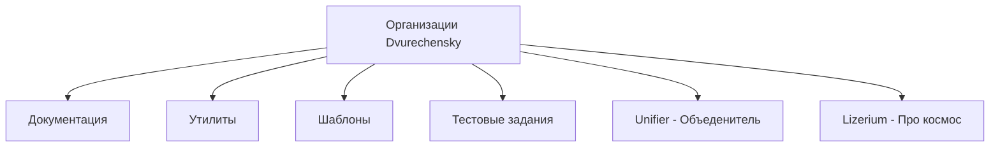
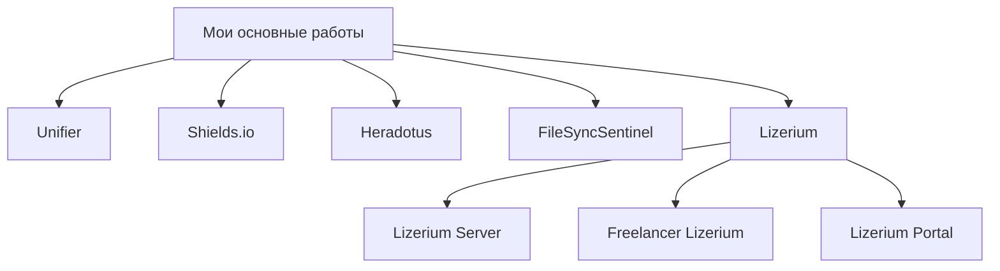
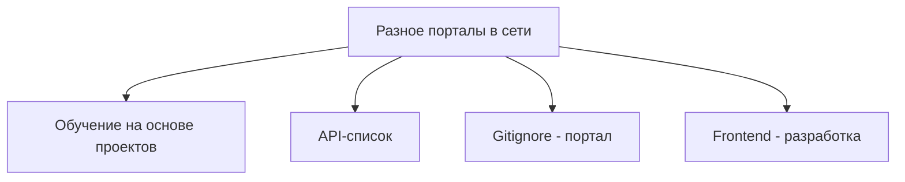
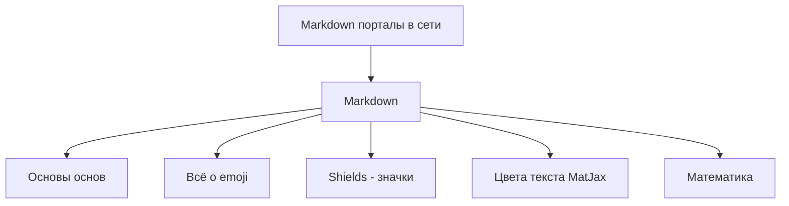
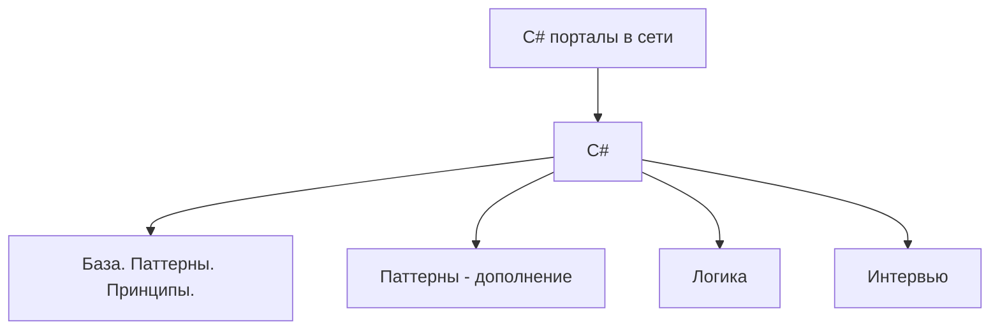
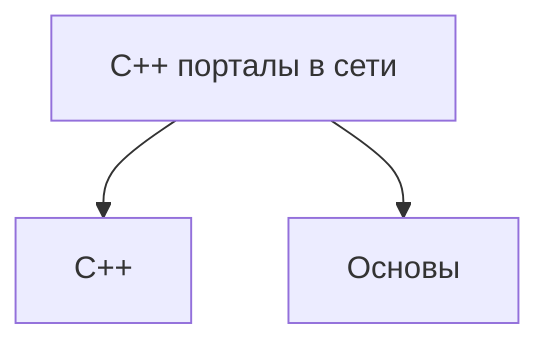
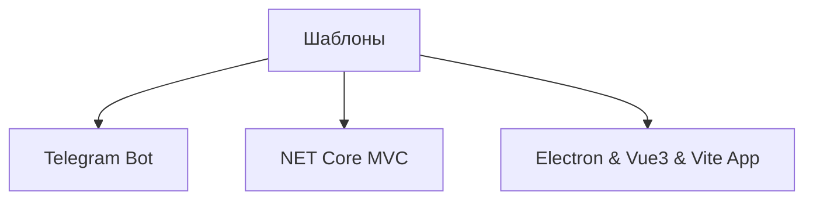

  <strong>🌐 Язык: </strong>
  
  
    ✅ 🇷🇺 Русский (текущий)
  
  | 
  <a href="/Dvurechensky/en.html" style="color: #0891b2; margin: 0 10px;">
    🇺🇸 English
  </a>

  <picture>
    
  </picture>
  <h2>👋 Всем привет, Я Николай Двуреченский  💻 Разработчик полного цикла</h2>

 
  
  

    
  

- 🎯 `Реверс`-инженер
- 🎯 `Системный`-инженер
- 🎯 `Full-stack` - разработчик на `Unity` · `.NET` · `TypeScript` · `Go`· `C#` и др.
- 🌌 `Универсальный` программист в мире **`Веб` · `Unity` · `Linux` · `Windows` · `Security`**

- [🚀 Обо мне](#-обо-мне)
- [🌌 Проекты · Утилиты · Организации](#-проекты--утилиты--организации)
  - [Проекты · Утилиты 🐠](#проекты--утилиты-)
    - [Важные работы 🌌](#важные-работы-)
    - [📚 C++ · GitHub](#-c--github)
    - [📚 Шаблоны](#-шаблоны)
- [💼 Опыт работы](#-опыт-работы)
- [🛠️ Технологический стек](#️-технологический-стек)
- [🧠 Текущие направления](#-текущие-направления)

## 🚀 Обо мне

- 💻 Начал программировать с реверс-инжиниринга онлайн-игр
- 🛠️ Создаю инструменты автоматизации, игровые клиенты и бэкенд-системы с 2014 года
- 🌍 Нахожусь в **Москве**
- 🎨 Увлекаюсь **NET, реверс-инжинирингом, Unity HDRP, Linux, безопасностью и экспериментальными проектами, владею практически всеми популярными языками**
- ⚡ Забавный факт: называю себя хакером — но в хорошем смысле, заканчил курс по белому хакингу от `CyberEd`😉

📫 Свяжитесь со мной: [dvurechensky_pro@mail.ru](mailto:dvurechensky_pro@mail.ru)
🌐 Портфолио: [dvurechensky.pro](https://sites.google.com/view/dvurechensky)

## 🌌 Проекты · Утилиты · Организации

<strong>🐌 Организации GitHub (6)</strong>

| 🔗 Проект                                                             | 📖 Описание                                                                                                                               |
| --------------------------------------------------------------------- | ----------------------------------------------------------------------------------------------------------------------------------------- |
| [Dvurechensky Docs](https://github.com/Dvurechensky-Docs)             | Мои разработки или чрезвычайно полезные форки документации, необходимые для повседневной разработки.                                      |
| [Dvurechensky Tools](https://github.com/Dvurechensky-Tools)           | Программы и утилиты, которые я модифицировал или создал с нуля, полезные в различных областях.                                            |
| [Dvurechensky Test Tasks](https://github.com/Dvurechensky-Test-Tasks) | Мой реестр тестовых заданий, выполненных мной бесплатно.                                                                                  |
| [Dvurechensky Templates](https://github.com/Dvurechensky-Templates)   | Мои шаблоны для создания проектов.                                                                                                        |
| [Lizerium](https://github.com/Lizerium)                               | Здесь собраны утилиты для игры Freelancer, созданные или воссозданные мной, проекты - Freelancer Lizerium Unity и модификация Freelancer. |
| [Unifier of Systems](https://github.com/Unifier-of-Systems)           | Унифицирующие сервисы и технологии.                                                                                                       |

### Проекты · Утилиты 🐠

 

<strong>Важные работы 💼 (8)</strong>

#### Важные работы 🌌

<table>
  <thead>
    <tr>
      <th>🔗 Проект</th>
      <th>📖 Описание</th>
      <th>Языки</th>
    </tr>
  </thead>
  <tbody>
    <tr>
      <td data-label="Проект"><a href="https://lizup.ru/">Lizerium Portal</a></td>
      <td data-label="Описание">Разработанный мной портал для <code>космического</code> <code>симулятора</code> — это огромный портал под игру с базой знаний о игре <code>Freelancer (2003)</code>.</td>
      <td data-label="Языки"><code>ASP Net Core 6.0 · MVC · TypeScript · EF Core</code></td>
    </tr>
    <tr>
      <td data-label="Проект"><a href="https://lizup.ru/Home/Game">Freelancer Lizerium</a></td>
      <td data-label="Описание">Разработанный мной <code>космический</code> <code>симулятор</code> — это моя игра в жанре <code>космические симуляторы</code> на базе <code>Freelancer (2003)</code> (Мультиплеер и одиночный режим).</td>
      <td data-label="Языки"><code>C++ · Assembler x86</code></td>
    </tr>
    <tr>
      <td data-label="Проект">
        <a href="https://lizup.ru/Home/Game">Lizerium Server</a> | 
        <a href="https://www.gs4u.net/ru/s/398133.html">GS4u.net — Мониторинг игровых серверов</a>
      </td>
      <td data-label="Описание">Разработанный мной сервер на <code>космический</code> <code>симулятор</code> <a href="https://lizup.ru/Home/Game">Freelancer Lizerium</a> — это огромное дополнение, которое состоит из 50+ плагинов, импортирующих новые функции в игровой процесс.</td>
      <td data-label="Языки"><code>C++ · Asm x86</code></td>
    </tr>
    <tr>
      <td data-label="Проект"><a href="https://lizup.ru/Home/Game">Lizerium Steam</a></td>
      <td data-label="Описание">Разработанный мной <code>загрузчик игр</code> серии Freelancer — это технически всем известный <code>Steam</code> по своему <code>поведению</code>, и он может <code>портировать</code> и <code>обновлять</code> содержимое и <code>сам себя</code>.</td>
      <td data-label="Языки"><code>WPF · Prism MVVM · Handy Control</code></td>
    </tr>
    <tr>
      <td data-label="Проект"><a href="https://github.com/Dvurechensky-Tools/Heradotus">Heradotus</a></td>
      <td data-label="Описание">Ваш <code>конструктор</code> <code>сценариев</code> для презентаций и демонстраций. Для разработчиков, понимающих <code>Markdown</code>.</td>
      <td data-label="Языки"><code>WPF · Prism MVVM · Handy Control</code></td>
    </tr>
    <tr>
      <td data-label="Проект"><a href="https://github.com/Dvurechensky-Tools/FileSyncSentinel">FileSyncSentinel</a></td>
      <td data-label="Описание">Мощный <code>мониторинг</code> изменений файлов в реальном времени с интеллектуальным <code>сравнением</code> 🔍.</td>
      <td data-label="Языки"><code>WinForms · MVC · DiffPlex · .NET 8.0</code></td>
    </tr>
    <tr>
      <td data-label="Проект"><a href="https://shields.dvurechensky.pro/">Русский Shields.io</a></td>
      <td data-label="Описание">Генератор красивых бейджей на русском языке.</td>
      <td data-label="Языки"><code>JS/TS · Canvas / WebGL · Node JS · Redis</code></td>
    </tr>
    <tr>
      <td data-label="Проект"><a href="https://unifier.dvurechensky.pro/">Unifier</a></td>
      <td data-label="Описание">Демонстрация операционных систем, графов их процессов, система управления устройствами.</td>
      <td data-label="Языки"><code>JS/TS · .NET 8.0 · Tree JS · Rabbit MQ · PostgreSQL</code></td>
    </tr>
  </tbody>
</table>

 

<strong>Интернет-порталы от меня 📚 (14)</strong>

<h4 align="center"> 📚 Разное · GitHub </h4>

| 🔗 Проект                                                                                | 📖 Описание                                                                                                                                                              |
| ---------------------------------------------------------------------------------------- | ------------------------------------------------------------------------------------------------------------------------------------------------------------------------ |
| [Обучение на основе проектов](https://dvurechensky-docs.github.io/ProjectBasedLearning/) | Ccылки на ресурсы по категориям языков программирования для обучения                                                                                                     |
| [API-список](https://dvurechensky-docs.github.io/Internet/)                              | Каталог открытых API по категориям                                                                                                                                       |
| [Gitignore - портал](https://dvurechensky-docs.github.io/Gitignore/)                     | Коллекция готовых `.gitignore` + экскурсия по технологиям                                                                                                                |
| [Frontend - разработка](https://dvurechensky-docs.github.io/WebFrontendKnowledge/)       | Постоянно расширяющийся список фреймворков, библиотек и инструментов, которые я использовал/хочу использовать для создания `Web-контента`. В основном, это `JavaScript`. |

<h4 align="center"> 📚 Markdown · GitHub </h4>

| 🔗 Проект                                                                                | 📖 Описание                                 |
| ---------------------------------------------------------------------------------------- | ------------------------------------------- |
| [Markdown основы основ](https://dvurechensky-docs.github.io/GeneralDocsMarkdown/)        | Полное руководство по Markdown с лайфхаками |
| [Emoji в Markdown](https://dvurechensky-docs.github.io/EmojiCollectionsMarkdown/)        | Коллекция Emoji                             |
| [Список значков Shields](https://dvurechensky-docs.github.io/ShieldsMarkdown/)           | Коллекция значков Shields                   |
| [Цвета текста через MathJax](https://dvurechensky-docs.github.io/MathJaxColorsMarkdown/) | Примеры цветного текста                     |
| [Математика в Markdown](https://dvurechensky-docs.github.io/MathMarkdown/)               | Пример реализации математических формул     |

<h4 align="center"> 📚 C# · GitHub </h4>

| 🔗 Проект                                                                                                                  | 📖 Описание                                                                                                                                                                    |
| -------------------------------------------------------------------------------------------------------------------------- | ------------------------------------------------------------------------------------------------------------------------------------------------------------------------------ |
| [Разбор языка программирования C#.](https://dvurechensky-docs.github.io/BasicKnowledgeCSharp/)                             | Обзор функционала языка програмиирования C#, решение задач.                                                                                                                    |
| [Шаблоны проектирования. ООП. Тестирование. Коллекции C#.](https://dvurechensky-docs.github.io/PatternsCSharpProgramming/) | Основы объектно-ориентированного программирования, а также шаблоны программирования в C# с примерами их реализации, тестирование, объянение принципов и решение задач LetCode. |
| [Паттерны (дополнение) C#](https://dvurechensky-docs.github.io/PatternsCSharpExtraAddons/)                                 | Образцы, шаблоны, схемы программирования в C# с примерами их реализации                                                                                                        |
| [Вопросы на собеседованиях по C# (NET)](https://dvurechensky-docs.github.io/InterviewCSharpNet/)                           | Обзор вопросов по языку программирования C# и технологии .NET                                                                                                                  |

#### 📚 C++ · GitHub

| 🔗 Проект                                                                                       | 📖 Описание                                                  |
| ----------------------------------------------------------------------------------------------- | ------------------------------------------------------------ |
| [Разбор 🚏 языка программирования C++.](https://dvurechensky-docs.github.io/BasicKnowledgeCPP/) | Обзор функционала языка програмиирования C++, решение задач. |

 

<strong>Шаблоны 📚 (3)</strong>

#### 📚 Шаблоны

| 🔗 Проект                                                                                                 | 📖 Описание                                                                                                                                   |
| --------------------------------------------------------------------------------------------------------- | --------------------------------------------------------------------------------------------------------------------------------------------- |
| [Telegram Bot 🚏 Шаблон.](https://github.com/Dvurechensky-Templates/TelegramBotTemplate)                  | Чистая, многоуровневая архитектура. Легко масштабируется и добавляет новые команды/сервисы.                                                   |
| [Net Core 🚏 Шаблон.](https://github.com/Dvurechensky-Templates/NetCoreTemplate)                          | ASP.NET Core MVC, шаблон проекта Frontend — TypeScript                                                                                        |
| [Electron & Vue3 & Vite 🚏 Template.](https://github.com/Dvurechensky-Templates/ElectronViteTemplateRuEn) | Шаблон проекта Vue3 + Vite + Electron, основанный на Vite и Rollup. альтернативный платформер для производства кроссплатформенных приложений. |

  <h3>📊 График моих активностей на GitHub</h3>
  

## 💼 Опыт работы

 Раскрыть 

<h4 align="center"><strong>OXSIONSOFT, Lizerium   (Март 2021 – Настоящее время, 4+ года)</strong></h4>

<i>Unity - разработчик</i>

- Работал над проектом <strong>Ceek Virtual Reality</strong>: разработка функционала, исправление ошибок, редизайн пользовательского интерфейса
   
- Реализовал оптимизацию памяти через <strong>Addressables</strong> → стабильная производительность на Android 7+
   
- Выполнил 3+ крупных эволюции пользовательского интерфейса, мультиплеер на <strong>Photon Engine</strong>, улучшения клиент-серверного API
   
- Писал технические спецификации, сотрудничал между командами
   
- <strong>Стек технологий:</strong> Unity3D, HDRP, VFX Graph, Zenject, Addressables, Blender, Substance, Photoshop, Docker, Photon Engine

<h4 align="center"><strong>Московский институт психоанализа (МИП)   (Февраль 2020 – Настоящее время, 5+ лет)</strong></h4>

<i>Технический специалист</i>

- Оказывал техническую поддержку для онлайн видео платформы (MTS-Link)
   
- Помог 1000+ пользователям любого возраста/устройства присоединиться к живым трансляциям
   
- <strong>Стек технологий:</strong> Windows, MacOS

<h4 align="center"><strong>NPC Reagent / SIGMA / CMK Consulting   (2019 – 2025, 5+ лет в общей сложности)</strong></h4>

<i>.NET Разработчик</i>

- Создавал <strong>ASP.NET Core MVC</strong> приложения с PostgreSQL, EF Core, RabbitMQ
   
- Разрабатывал системы визуализации для C# / C++ проектов и зависимостей (NuGet)
   
- Мигрировал проекты с .NET Framework → .NET 6/7/8, применял принципы SOLID, DRY, KISS
   
- Проектировал систему мониторинга пентестов (сбор данных, визуализация, аналитика)
   
- Развертывал микросервисы в <strong>Docker</strong>, автоматизировал сборки с Jenkins
   
- <strong>Стек технологий:</strong> C#, ASP.NET Core (6–8), PostgreSQL, RabbitMQ, EF Core, Cytoscape.js, Three.js, Docker, Jenkins, Git, SVN

<h4 align="center"><strong>Freelancer Rebirth   (Ноябрь 2020 – Ноябрь 2023, 3 года)</strong></h4>

<i>C++ Разработчик</i>

- Поддерживал крупнейший мод для СНГ для <strong>Freelancer (2003)</strong>
   
- Мигрировал 25+ плагинов и ядро в унифицированное C++ решение
   
- Выполнил 3 крупные миграции проекта между поколениями Visual Studio
   
- <strong>Стек технологий:</strong> C++, Boost, Assembler, Git

<h4 align="center"><strong>ИнтерЭВМ & ЦИТиС   (Февраль 2020 – Июнь 2023, 3+ года)</strong></h4>

<i>Системный инженер</i>

- Разрабатывал системы мониторинга (Qt) и анализаторы данных (Python, PHP)
   
- Создавал XSLT шаблоны, оптимизировал PostgreSQL запросы
   
- Работал с окружениями Astra Linux, Ubuntu, Debian, Windows
   
- <strong>Стек технологий:</strong> Linux (Astra, Ubuntu, Debian), Qt, PHP, Python, SQL, XSLT/XML

<h4 align="center"><strong>Другие роли   (2017 – 2020)</strong></h4>

- <strong>ООО Промэлектроника (Липецк)</strong> — Инженер по автоматизации: контроллеры Siemens, SCADA, встраиваемые системы
   
- <strong>ЮрЭксперт (Воронеж)</strong> — Системный администратор: автоматизация рабочих мест, автоматизация документооборота

## 🛠️ Технологический стек

 Раскрыть 

<h4><strong>Технологии ядра:</strong></h4>
C#, .NET 3–8, ASP.NET Core (MVC, SignalR), EF Core, RabbitMQ, Redis, Prism (MVVM WPF), Elixir

<h4><strong>Визуализация:</strong></h4>
TypeScript, Cytoscape.js, Three.js, Webpack, Grunt, HandyContol(WPF)

<h4><strong>Тестирование:</strong></h4>
xUnit, nUnit, Integrated

<h4><strong>Игровая разработка:</strong></h4>
Unity (HDRP/URP, Zenject, Addressables, Photon, Object Pooling), ECS (Leo / Unity / Custom), Blender, Substance Painter, Photoshop

<h4><strong>Базы данных:</strong></h4>
PostgreSQL, SQL Server, Redis, MySQL, EF Core

<h4><strong>Инженерные навыки:</strong></h4>
Linux (Astra, Ubuntu, Debian, Kali, Parrot OS), Docker, Jenkins, nginx, Git, SVN, Gitea

<h4><strong>Языки и инструменты:</strong></h4>
Python, Си, С++, С#, PHP, Go, Asm x86, Fortran77, Markdown, Shell, HTML5, SCSS/CSS, Boost, Qt, Bash, IDA Pro, OllyDbg, Burp Suite Pro

## 🧠 Текущие направления

- Кроссплатформенные инструменты для .NET 8 / Linux
- Боты для всех популярных соц. сетей
- Расширение порталов с открытым исходным кодом и документацией
- Автоматизация всех процессов и выход на свою систему управления проектов

`Псевдонимы в сети:` **Dvurechensky** · **dvurechensky_pro** · **Dvurechensky Media** · **Dormammu Media** · **Rota**

<h2 align="center">
    👥Репозитории👥
</h2>

<a href="https://www.dvurechensky.pro/" target="_blank" rel="noreferrer"><svg role="img" viewBox="0 0 24 24" width="32" height="32" fill="#162" xmlns="http://www.w3.org/2000/svg"><title>Gitea</title><path d="M4.209 4.603c-.247 0-.525.02-.84.088-.333.07-1.28.283-2.054 1.027C-.403 7.25.035 9.685.089 10.052c.065.446.263 1.687 1.21 2.768 1.749 2.141 5.513 2.092 5.513 2.092s.462 1.103 1.168 2.119c.955 1.263 1.936 2.248 2.89 2.367 2.406 0 7.212-.004 7.212-.004s.458.004 1.08-.394c.535-.324 1.013-.893 1.013-.893s.492-.527 1.18-1.73c.21-.37.385-.729.538-1.068 0 0 2.107-4.471 2.107-8.823-.042-1.318-.367-1.55-.443-1.627-.156-.156-.366-.153-.366-.153s-4.475.252-6.792.306c-.508.011-1.012.023-1.512.027v4.474l-.634-.301c0-1.39-.004-4.17-.004-4.17-1.107.016-3.405-.084-3.405-.084s-5.399-.27-5.987-.324c-.187-.011-.401-.032-.648-.032zm.354 1.832h.111s.271 2.269.6 3.597C5.549 11.147 6.22 13 6.22 13s-.996-.119-1.641-.348c-.99-.324-1.409-.714-1.409-.714s-.73-.511-1.096-1.52C1.444 8.73 2.021 7.7 2.021 7.7s.32-.859 1.47-1.145c.395-.106.863-.12 1.072-.12zm8.33 2.554c.26.003.509.127.509.127l.868.422-.529 1.075a.686.686 0 0 0-.614.359.685.685 0 0 0 .072.756l-.939 1.924a.69.69 0 0 0-.66.527.687.687 0 0 0 .347.763.686.686 0 0 0 .867-.206.688.688 0 0 0-.069-.882l.916-1.874a.667.667 0 0 0 .237-.02.657.657 0 0 0 .271-.137 8.826 8.826 0 0 1 1.016.512.761.761 0 0 1 .286.282c.073.21-.073.569-.073.569-.087.29-.702 1.55-.702 1.55a.692.692 0 0 0-.676.477.681.681 0 1 0 1.157-.252c.073-.141.141-.282.214-.431.19-.397.515-1.16.515-1.16.035-.066.218-.394.103-.814-.095-.435-.48-.638-.48-.638-.467-.301-1.116-.58-1.116-.58s0-.156-.042-.27a.688.688 0 0 0-.148-.241l.516-1.062 2.89 1.401s.48.218.583.619c.073.282-.019.534-.069.657-.24.587-2.1 4.317-2.1 4.317s-.232.554-.748.588a1.065 1.065 0 0 1-.393-.045l-.202-.08-4.31-2.1s-.417-.218-.49-.596c-.083-.31.104-.691.104-.691l2.073-4.272s.183-.37.466-.497a.855.855 0 0 1 .35-.077z"/></svg></a>
<a href="https://codeberg.org/Dvurechensky" target="_blank" rel="noreferrer"><svg role="img" width="32" fill="#716" height="32" viewBox="0 0 24 24" xmlns="http://www.w3.org/2000/svg"><title>Codeberg</title><path d="M11.999.747A11.974 11.974 0 0 0 0 12.75c0 2.254.635 4.465 1.833 6.376L11.837 6.19c.072-.092.251-.092.323 0l4.178 5.402h-2.992l.065.239h3.113l.882 1.138h-3.674l.103.374h3.86l.777 1.003h-4.358l.135.483h4.593l.695.894h-5.038l.165.589h5.326l.609.785h-5.717l.182.65h6.038l.562.727h-6.397l.183.65h6.717A12.003 12.003 0 0 0 24 12.75 11.977 11.977 0 0 0 11.999.747zm3.654 19.104.182.65h5.326c.173-.204.353-.433.513-.65zm.385 1.377.18.65h3.563c.233-.198.485-.428.712-.65zm.383 1.377.182.648h1.203c.356-.204.685-.412 1.042-.648zz"/></svg></a>

<h2 align="center">
    🌐 Мессенджеры 🌐
</h2>

<a href="https://steamcommunity.com/id/dvurechensky/" target="_blank" rel="noreferrer"><svg width="32" height="32" role="img" viewBox="0 0 24 24" fill="#178"  xmlns="http://www.w3.org/2000/svg"><title>Steam</title><path d="M11.979 0C5.678 0 .511 4.86.022 11.037l6.432 2.658c.545-.371 1.203-.59 1.912-.59.063 0 .125.004.188.006l2.861-4.142V8.91c0-2.495 2.028-4.524 4.524-4.524 2.494 0 4.524 2.031 4.524 4.527s-2.03 4.525-4.524 4.525h-.105l-4.076 2.911c0 .052.004.105.004.159 0 1.875-1.515 3.396-3.39 3.396-1.635 0-3.016-1.173-3.331-2.727L.436 15.27C1.862 20.307 6.486 24 11.979 24c6.627 0 11.999-5.373 11.999-12S18.605 0 11.979 0zM7.54 18.21l-1.473-.61c.262.543.714.999 1.314 1.25 1.297.539 2.793-.076 3.332-1.375.263-.63.264-1.319.005-1.949s-.75-1.121-1.377-1.383c-.624-.26-1.29-.249-1.878-.03l1.523.63c.956.4 1.409 1.5 1.009 2.455-.397.957-1.497 1.41-2.454 1.012H7.54zm11.415-9.303c0-1.662-1.353-3.015-3.015-3.015-1.665 0-3.015 1.353-3.015 3.015 0 1.665 1.35 3.015 3.015 3.015 1.663 0 3.015-1.35 3.015-3.015zm-5.273-.005c0-1.252 1.013-2.266 2.265-2.266 1.249 0 2.266 1.014 2.266 2.266 0 1.251-1.017 2.265-2.266 2.265-1.253 0-2.265-1.014-2.265-2.265z"/></svg></a>
<a href="https://t.me/dvurechensky_pro" target="_blank" rel="noreferrer"><svg width="32" height="32" fill="#716" role="img" viewBox="0 0 24 24" xmlns="http://www.w3.org/2000/svg"><title>Telegram</title><path d="M11.944 0A12 12 0 0 0 0 12a12 12 0 0 0 12 12 12 12 0 0 0 12-12A12 12 0 0 0 12 0a12 12 0 0 0-.056 0zm4.962 7.224c.1-.002.321.023.465.14a.506.506 0 0 1 .171.325c.016.093.036.306.02.472-.18 1.898-.962 6.502-1.36 8.627-.168.9-.499 1.201-.82 1.23-.696.065-1.225-.46-1.9-.902-1.056-.693-1.653-1.124-2.678-1.8-1.185-.78-.417-1.21.258-1.91.177-.184 3.247-2.977 3.307-3.23.007-.032.014-.15-.056-.212s-.174-.041-.249-.024c-.106.024-1.793 1.14-5.061 3.345-.48.33-.913.49-1.302.48-.428-.008-1.252-.241-1.865-.44-.752-.245-1.349-.374-1.297-.789.027-.216.325-.437.893-.663 3.498-1.524 5.83-2.529 6.998-3.014 3.332-1.386 4.025-1.627 4.476-1.635z"/></svg></a>

<h2 align="center">
    🌌 Социальные сети 🌌
</h2>

<a href="https://vk.com/dvurechensky_pro" target="_blank" rel="noreferrer"><svg role="img" width="32" fill="#059" height="32" viewBox="0 0 24 24" xmlns="http://www.w3.org/2000/svg"><title>VK</title><path d="m9.489.004.729-.003h3.564l.73.003.914.01.433.007.418.011.403.014.388.016.374.021.36.025.345.03.333.033c1.74.196 2.933.616 3.833 1.516.9.9 1.32 2.092 1.516 3.833l.034.333.029.346.025.36.02.373.025.588.012.41.013.644.009.915.004.98-.001 3.313-.003.73-.01.914-.007.433-.011.418-.014.403-.016.388-.021.374-.025.36-.03.345-.033.333c-.196 1.74-.616 2.933-1.516 3.833-.9.9-2.092 1.32-3.833 1.516l-.333.034-.346.029-.36.025-.373.02-.588.025-.41.012-.644.013-.915.009-.98.004-3.313-.001-.73-.003-.914-.01-.433-.007-.418-.011-.403-.014-.388-.016-.374-.021-.36-.025-.345-.03-.333-.033c-1.74-.196-2.933-.616-3.833-1.516-.9-.9-1.32-2.092-1.516-3.833l-.034-.333-.029-.346-.025-.36-.02-.373-.025-.588-.012-.41-.013-.644-.009-.915-.004-.98.001-3.313.003-.73.01-.914.007-.433.011-.418.014-.403.016-.388.021-.374.025-.36.03-.345.033-.333c.196-1.74.616-2.933 1.516-3.833.9-.9 2.092-1.32 3.833-1.516l.333-.034.346-.029.36-.025.373-.02.588-.025.41-.012.644-.013.915-.009ZM6.79 7.3H4.05c.13 6.24 3.25 9.99 8.72 9.99h.31v-3.57c2.01.2 3.53 1.67 4.14 3.57h2.84c-.78-2.84-2.83-4.41-4.11-5.01 1.28-.74 3.08-2.54 3.51-4.98h-2.58c-.56 1.98-2.22 3.78-3.8 3.95V7.3H10.5v6.92c-1.6-.4-3.62-2.34-3.71-6.92Z"/></svg></a>

<h2 align="center">
    🎇 Видеоблоги 🎇
</h2>

     

    
    &nbsp;
    
    &nbsp;
    
    &nbsp;
    
    &nbsp;
    
    &nbsp;
    
    &nbsp;
    
    

    

        

        
    
 
    
 

<!-- Donationes -->

<table align="center" style="border-collapse: collapse; min-width: 300px; width: 100%;">
<tr>
    <td colspan="3" align="center">
    <b>💚 Спасибо за вашу поддержку! Вы можете сделать пожертвование, используя информацию ниже. 🙏</b>
    </td>
</tr>
<tr>
    <th style="padding: 8px; text-align: center;">Платежи</th>
    <th style="padding: 8px; text-align: center;">Адрес</th>
    <th style="padding: 8px; text-align: center;">QR-код</th>
</tr>
<tr>
    <td style="padding: 8px; text-align: center;">
    
    </td>
    <td style="padding: 8px; text-align: center;"><code>bc1qlrqjhdeqtzd0dnvw7lj0gc0r8kke8m8rc7dxym</code></td>
    <td style="padding: 8px; text-align: center;"></td>
</tr>
<tr>
    <td style="padding: 8px; text-align: center;">
    
    </td>
    <td style="padding: 8px; text-align: center;"><code>dvurechensky_pro</code></td>
    <td style="padding: 8px; text-align: center;"></td>
</tr>
</table>

> 2025
